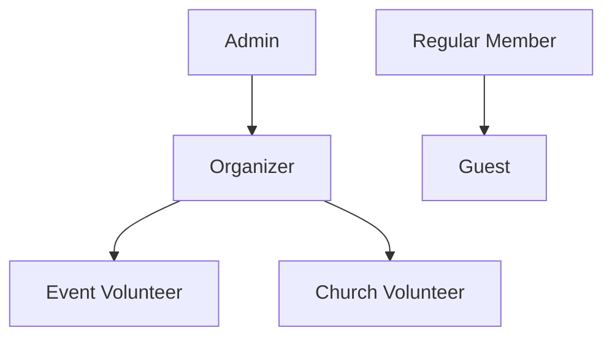
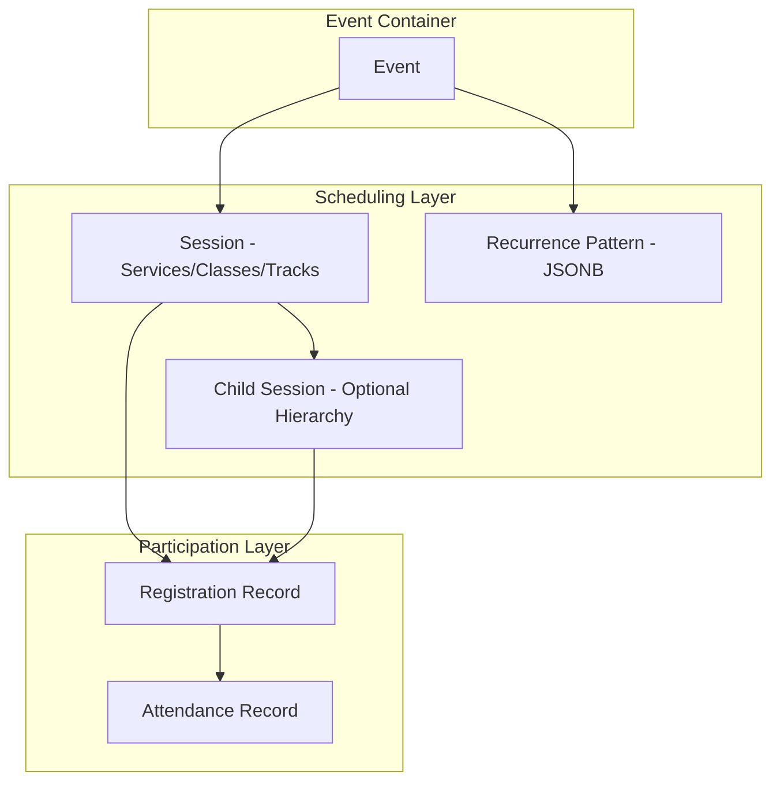
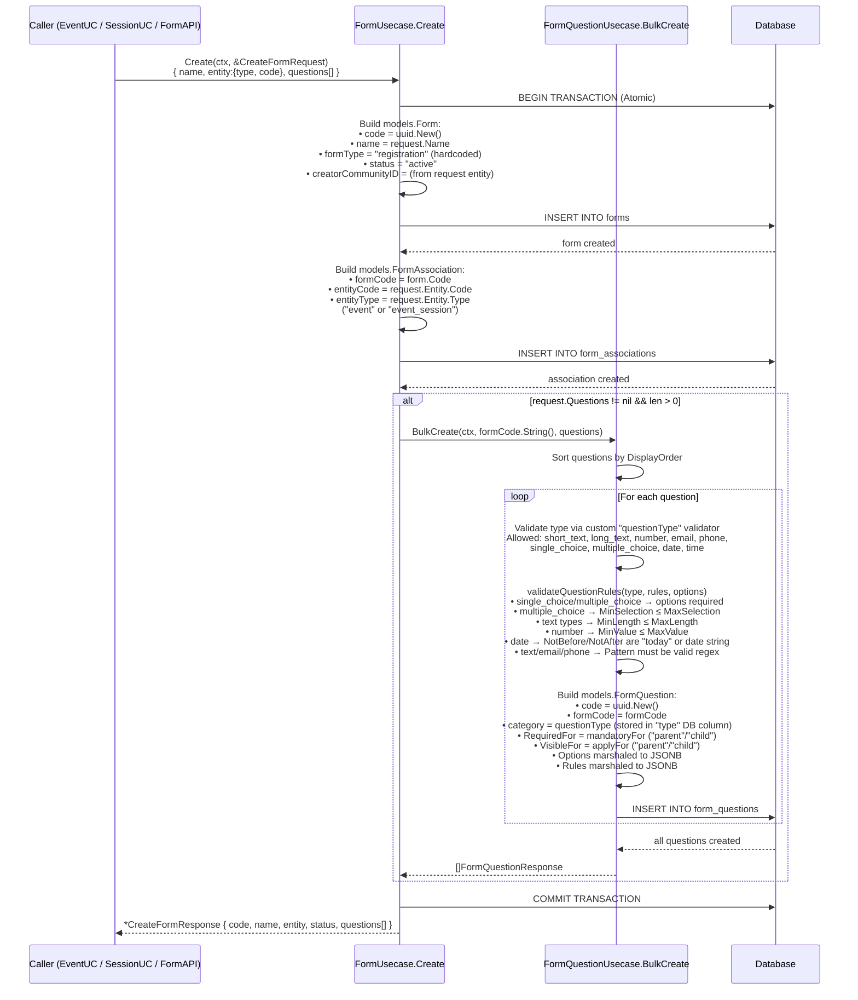
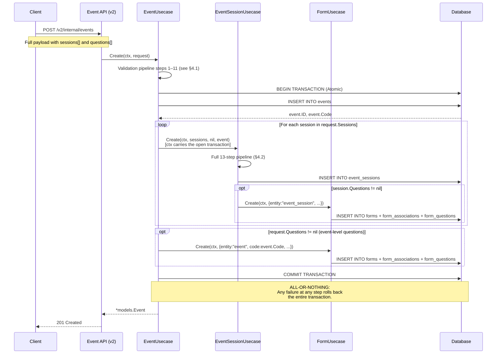
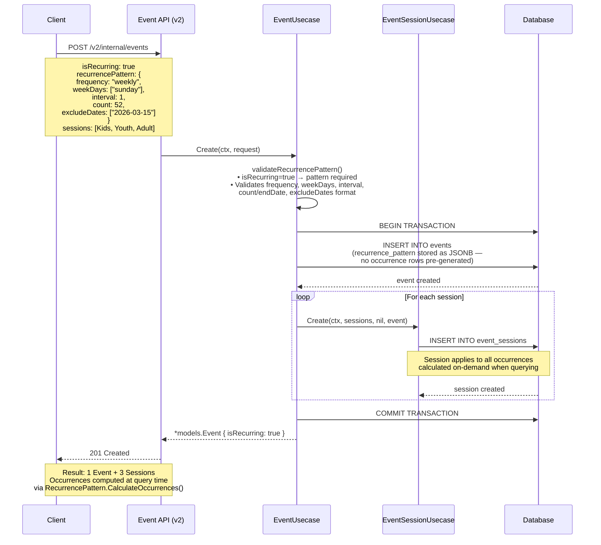
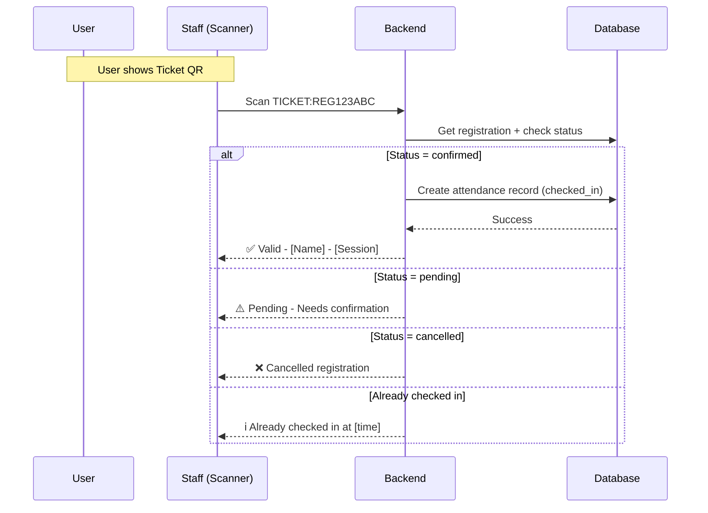

# Church Event Management System - Technical Specification

**Version:** 3.0
**Date:** February 2026 (Revised - Removed event_occurrences table)
**Status:** ✅ Approved - Ready for Implementation

---

## 0. Design Decisions Summary

| Decision         | Choice                                         | Notes                                                         |
| ---------------- | ---------------------------------------------- | ------------------------------------------------------------- |
| Campus Filtering | Configurable per event                         | Can enable/disable campus restrictions                        |
| Migration        | Migration script                               | Transform existing data to new schema                         |
| Church Volunteer | Existing `volunteer` user_type                 | No changes needed                                             |
| Event Volunteer  | New `event_volunteer` role                     | To be created for per-event permissions                       |
| QR Generation    | Frontend generates                             | Backend provides data (community_id, registration_code, etc.) |
| Custom Forms     | Hierarchical (Event → Session → Child Session) | Each level can override parent                                |
| Notifications    | Tiered approach                                | Per pricing research below                                    |

---

## 1. Executive Summary

This document outlines the technical specification for a **modular, extensible church event management system**. The system is designed to handle diverse event types including Sunday Services, Christmas Celebrations, Conferences with multiple tracks, Volunteer Meetings, and Announcement-only events.

### Key Objectives

- **Modularity**: Flexible event structure supporting various use cases
- **Scalability**: Designed for free-tier constraints while being upgrade-ready
- **User Experience**: Streamlined QR-based registration and check-in flows
- **Data-Driven**: Comprehensive attendance tracking and reporting

### Technology Stack

| Component    | Technology            | Tier       |
| ------------ | --------------------- | ---------- |
| Backend      | Go (Echo Framework)   | Existing   |
| Database     | Supabase PostgreSQL   | Free Tier  |
| File Storage | Uploadthing           | Free Tier  |
| Hosting      | Google Cloud Platform | Free Tier  |
| Auth         | Existing RBAC System  | Integrated |

---

## 2. User Roles & Permissions

### 2.1 Role Hierarchy



### 2.2 Role Definitions

| Role                 | Description             | Key Capabilities                                                                                            |
| -------------------- | ----------------------- | ----------------------------------------------------------------------------------------------------------- |
| **Admin**            | System administrators   | Full CRUD on all events, manage users/roles, access all reports, configure system settings                  |
| **Organizer**        | Event creators/managers | Create/edit/delete own events, manage registrations, view reports for their events, assign event volunteers |
| **Event Volunteer**  | Per-event helpers       | Scan QR codes for check-in, view attendee list for assigned events, cannot modify event details             |
| **Church Volunteer** | Internal church staff   | Access volunteer-only private events, similar to Regular Member for public events                           |
| **Regular Member**   | Authenticated users     | Browse public events, register, view personal attendance history, manage profile                            |
| **Guest**            | Unauthenticated users   | View public announcements, limited registration (requires identifier)                                       |

### 2.3 Permission Matrix

| Action              | Admin | Organizer | Event Vol | Church Vol | Member | Guest |
| ------------------- | :---: | :-------: | :-------: | :--------: | :----: | :---: |
| Create Event        |  ✅   |    ✅     |    ❌     |     ❌     |   ❌   |  ❌   |
| Edit Own Event      |  ✅   |    ✅     |    ❌     |     ❌     |   ❌   |  ❌   |
| Delete Event        |  ✅   |   ✅\*    |    ❌     |     ❌     |   ❌   |  ❌   |
| View All Events     |  ✅   |    ✅     |    ❌     |     ❌     |   ❌   |  ❌   |
| View Public Events  |  ✅   |    ✅     |    ✅     |     ✅     |   ✅   |  ✅   |
| View Private Events |  ✅   |   ✅\*    |   ✅\*    |    ✅\*    |   ❌   |  ❌   |
| Scan QR (Check-in)  |  ✅   |    ✅     |    ✅     |     ❌     |   ❌   |  ❌   |
| Register for Events |  ✅   |    ✅     |    ✅     |     ✅     |   ✅   | ✅\*  |
| View Reports        |  ✅   |   ✅\*    |    ❌     |     ❌     |   ❌   |  ❌   |
| Export Data         |  ✅   |   ✅\*    |    ❌     |     ❌     |   ❌   |  ❌   |
| Manage Users        |  ✅   |    ❌     |    ❌     |     ❌     |   ❌   |  ❌   |

_\* = Limited to assigned/own resources_

---

## 3. Event Architecture

### 3.1 Entity Hierarchy



> [!IMPORTANT]
> **On-Demand Occurrence Calculation**: For recurring events, occurrence dates are calculated on-demand based on the `recurrence_pattern` JSONB field. No separate `event_occurrences` table is used. This approach:
> 
> - Avoids pre-generating potentially hundreds of database rows
> - Improves performance for long-running recurring events
> - Makes recurrence pattern modifications instant (no regeneration needed)
> - Reduces database storage requirements

> [!NOTE]
> **Unified Session Model**: Sessions now handle all sub-event types (services, classes, tracks, breakouts). Use `session_type` to differentiate and `parent_session_id` for hierarchical events like conferences.

### 3.2 Event Types

| Type           | Description                        | Example                     | Registration | Check-in |
| -------------- | ---------------------------------- | --------------------------- | ------------ | -------- |
| `REGISTRATION` | Standard registerable event        | Christmas Event, Conference | Required     | Optional |
| `ATTENDANCE`   | Recurring attendance tracking      | Sunday Service              | Optional     | Required |
| `ANNOUNCEMENT` | Information-only                   | Event Announcement          | None         | None     |
| `VOLUNTEER`    | Internal volunteer events          | Monthly Volunteer Meeting   | Required     | Optional |
| `HYBRID`       | Combines registration + attendance | Training Series             | Required     | Required |

### 3.3 Event Visibility

| Level             | Who Can See                | Use Case                  |
| ----------------- | -------------------------- | ------------------------- |
| `PUBLIC`          | Everyone including guests  | Sunday Service, Christmas |
| `MEMBERS_ONLY`    | Authenticated members      | Member-exclusive events   |
| `VOLUNTEER_ONLY`  | Church Volunteers + Staff  | Internal volunteer events |
| `PRIVATE`         | Invited users only         | Leadership meetings       |
| `CAMPUS_SPECIFIC` | Users from specific campus | Campus-specific events    |

### 3.4 Registration Configuration

Sessions can be configured with different registration rules to handle various scenarios:

#### Registration Mode

| Mode                  | Description                                           | Use Case                                    |
| --------------------- | ----------------------------------------------------- | ------------------------------------------- |
| `self_only`           | User can only register themselves                     | Volunteer meetings, limited capacity events |
| `self_and_registered` | User can register themselves + other registered users | Family events where all must have accounts  |
| `self_and_others`     | User can register themselves + guests (default)       | Christmas service, public events            |

#### Additional Registration Options

| Option                            | Type    | Description                                                   |
| --------------------------------- | ------- | ------------------------------------------------------------- |
| `max_registrations_per_user`      | INTEGER | Max people one user can register (including self). Default: 1 |
| `one_session_per_event`           | BOOLEAN | If true, user can only register for ONE session in this event |

**Note:** Per-registrant form field control is handled by `identifierConfig` (see §3.5), not by a separate form mode field. The `mandatory_for` / `apply_for` arrays on each form question handle which registrant contexts see or must answer a question.

#### Example Configurations

```json
// Volunteer meeting: self-only, one session per event
{
  "registration_mode": "self_only",
  "max_registrations_per_user": 1,
  "one_session_per_event": true
}

// Christmas service: family registration allowed
{
  "registration_mode": "self_and_others",
  "max_registrations_per_user": 5
}

// Conference: registered users only
{
  "registration_mode": "self_and_registered",
  "max_registrations_per_user": 3
}
```

### 3.5 Identifier Configuration

Each session can configure which identifier fields are **visible** and **required** for both primary and additional registrants. This is the replacement for the old `additional_registrant_form_mode` field and is stored as the `identifier_config` JSONB column on `event_sessions`.

#### Available Identifier Fields

| Field         | Go field      | Description                  | Example            |
| ------------- | ------------- | ---------------------------- | ------------------ |
| `name`        | `name`        | Full name of registrant      | "John Doe"         |
| `email`       | `email`       | Email address                | "john@example.com" |
| `phone`       | `phone`       | Phone number                 | "+62812345678"     |
| `communityId` | `communityId` | Internal community member ID | "GKI-001"          |

#### Configuration Structure

Maps to `SessionIdentifierConfig` in the Go model. Each field has two boolean properties:

- **`visible`**: Whether the field is shown on the form
- **`required`**: Whether the field must be filled (only applies if `visible: true`)

```json
{
  "identifier_config": {
    "primary": {
      "name": { "visible": true, "required": true },
      "email": { "visible": true, "required": true },
      "phone": { "visible": true, "required": false },
      "communityId": { "visible": false, "required": false }
    },
    "additional": {
      "name": { "visible": true, "required": true },
      "email": { "visible": false, "required": false },
      "phone": { "visible": false, "required": false },
      "communityId": { "visible": false, "required": false }
    }
  }
}
```

#### Common Patterns

| Scenario                     | Primary Config                                | Additional Config        |
| ---------------------------- | --------------------------------------------- | ------------------------ |
| **Family registration**      | name ✓, email ✓, phone optional               | name ✓ only              |
| **Conference (all contact)** | name ✓, email ✓, phone ✓                      | name ✓, email ✓          |
| **Member-only event**        | name ✓, email ✓, communityId ✓ (required)     | name ✓, communityId ✓    |
| **Simple attendance**        | name ✓                                        | name ✓                   |

### 3.6 Geolocation Validation

Events and sessions can enforce geolocation validation to ensure attendees are physically present at the venue. This is configurable based on registration method.

#### Geolocation Configuration

| Field                          | Type    | Description                               |
| ------------------------------ | ------- | ----------------------------------------- |
| `geolocation_required`         | BOOLEAN | Whether geolocation validation is enabled |
| `geolocation_radius_meters`    | INTEGER | Allowed distance from venue (in meters)   |
| `geolocation_validation_rules` | JSONB   | Rules for when to validate location       |

#### Validation Rules by Registration Method

| Registration Method                 | Default Behavior                  | Configurable |
| ----------------------------------- | --------------------------------- | ------------ |
| **Personal QR** (scanned by staff)  | Offline - requires location check | ✅ Yes       |
| **Event/Session QR** (self-service) | Online - no location check        | ✅ Yes       |
| **Manual entry**                    | Offline - requires location check | ✅ Yes       |
| **Web registration**                | Online - no location check        | ✅ Yes       |

#### Configuration Structure

```json
{
  "geolocation_config": {
    "enabled": true,
    "venue_latitude": -6.2,
    "venue_longitude": 106.816666,
    "radius_meters": 100,
    "validation_rules": {
      "personal_qr": {
        "require_location": true,
        "allow_override": false
      },
      "event_qr": {
        "require_location": false,
        "allow_override": true
      },
      "session_qr": {
        "require_location": false,
        "allow_override": true
      },
      "manual": {
        "require_location": true,
        "allow_override": true
      },
      "web": {
        "require_location": false,
        "allow_override": false
      }
    },
    "error_action": "reject" // or "warn"
  }
}
```

#### Common Scenarios

| Scenario                | Configuration                                                   |
| ----------------------- | --------------------------------------------------------------- |
| **Strict on-site only** | All methods require location, radius: 50m, error_action: reject |
| **Hybrid event**        | Personal QR requires location, Event QR doesn't                 |
| **Flexible check-in**   | Location required but allow_override: true for staff            |
| **Fully online**        | geolocation_config.enabled: false                               |

#### Validation Flow

```
1. User attempts registration/check-in
2. System checks registration_method
3. If geolocation_config.validation_rules[method].require_location == true:
   a. Request user's current location
   b. Calculate distance from venue
   c. If distance > radius_meters:
      - If error_action == "reject": Block registration
      - If error_action == "warn": Allow but log warning
      - If allow_override == true: Staff can manually approve
4. Proceed with registration/check-in
```

---

## 4. Sequence Diagrams

### 4.1 Event Creation Flow

This diagram shows the complete flow of creating an event. Sessions and questions are created **atomically inside the same database transaction** — one commit or one rollback.

```mermaid
sequenceDiagram
    participant Client
    participant API as Event API (v2)
    participant UC as EventUsecase.Create
    participant DB as Database

    Client->>API: POST /v2/internal/events
    Note over Client,API: CreateEventRequest:<br/>- title, category, status<br/>- images (imageLinks, bannerLink)<br/>- organizer (communityIds, contactIds)<br/>- access (level, allowedUserTypes/Roles/Campuses)<br/>- location (type, address, virtualLink, CTA)<br/>- schedule (startAt, endAt, timezone)<br/>- recurrence (isRecurring, recurrencePattern)<br/>- template (isTemplate, templateId, seriesId)<br/>- notification (channels, reminderConfig)<br/>- sessions[] (optional, created atomically)<br/>- questions[] (optional, form created atomically)

    API->>API: Struct-tag validation (go-playground/validator)
    alt Validation Failed
        API-->>Client: 422 Unprocessable Entity
    end

    API->>UC: Create(ctx, request)

    UC->>UC: Step 1 – Extract creatorCommunityID from JWT context
    alt Context missing community_id
        UC-->>API: 401 Unauthorized
    end

    UC->>UC: Step 2 – normalizeEventRequest()<br/>• Default status = "draft"<br/>• Default timezone = "Asia/Jakarta"<br/>• Default locationVisibility = "all"<br/>• Default CTA.Link = "NORMAL_FLOW"<br/>• Default CTA.Text = "Register Here!"<br/>• Draft event forces all sessions to "draft"

    UC->>UC: Step 3 – generateUniqueEventCode() with retries<br/>• IdentifierCode(config.EncodeCode, time.Now())<br/>• CheckByCode(code) – retry on collision<br/>• Exponential backoff, max = EventCodeMaxRetries
    alt All retries exhausted
        UC-->>API: 500 Internal Server Error
    end

    UC->>UC: Step 4 – generateEventSlug()<br/>• Use provided slug if len ≥ MinSlug<br/>• Otherwise Slug(eventCode, time.Now())<br/>• CheckBySlug → reject if duplicate
    alt Slug duplicate
        UC-->>API: 409 Conflict
    end

    UC->>UC: Step 5 – validateAccessControl()<br/>• PUBLIC → clear all restrictions<br/>• Campus check: config map lookup<br/>• Roles, UserTypes: DB CheckMultiple (cached)<br/>• CommunityIDs: DB CheckMultiple
    alt Invalid access config
        UC-->>API: 404 / 422 error
    end

    UC->>UC: Step 6 – validateOrganizers()<br/>• contactCommunityIds → DB CheckMultiple (cached)<br/>• organizerCommunityIds → DB CheckMultiple (cached)

    UC->>UC: Step 7 – request.Location.Validate(&category)<br/>• Required fields checked per locationType<br/>• CTA consistency validated

    UC->>UC: Step 7b – CTA normalization<br/>• text only → link = "NORMAL_FLOW"<br/>• link only → text = "Register Here!"<br/>• neither → both defaults

    UC->>UC: Step 8 – validateSchedule()<br/>• startAt required<br/>• endAt > startAt<br/>• startAt not > 1 day in the past

    UC->>UC: Step 9 – validateRecurrencePattern() if isRecurring<br/>• recurrencePattern must be present<br/>• Validates frequency, weekDays, count/endDate, etc.

    UC->>UC: Step 10 – validateNotification()<br/>• reminderConfig requires notificationChannels to be set

    UC->>UC: Step 11 – Build Event model<br/>• Marshal RecurrencePattern → JSONB<br/>• Marshal ReminderConfig → JSONB<br/>• "announcement" + sessions != nil → reject

    UC->>DB: BEGIN TRANSACTION (Atomic)
    UC->>DB: INSERT INTO events
    DB-->>UC: event.ID assigned

    alt request.Sessions != nil
        loop For each session in request.Sessions
            UC->>UC: EventSession.Create(ctx, sessions, nil, event)<br/>(ctx carries transaction — no separate Atomic)
            Note over UC: Full 13-step session pipeline (§4.2)
            UC->>DB: INSERT INTO event_sessions
            opt session.Questions != nil
                UC->>DB: INSERT INTO forms + associations + form_questions
            end
        end
        alt Any session/form step fails
            UC->>DB: ROLLBACK
            UC-->>API: Error
        end
    end

    alt request.Questions != nil
        UC->>UC: Build CreateFormRequest:<br/>name=event.Title, entity={type:"event", code:event.Code}
        UC->>UC: Form.Create(ctx, &formRequest)
        UC->>DB: INSERT INTO forms
        UC->>DB: INSERT INTO form_associations
        UC->>DB: INSERT INTO form_questions (bulk)
        alt Form step fails
            UC->>DB: ROLLBACK
            UC-->>API: Error
        end
    end

    UC->>DB: COMMIT TRANSACTION
    UC-->>API: *models.Event
    API-->>Client: 201 Created
```



### 4.2 Event Session Creation Flow

Sessions can be created standalone via the API or inline with the event (§4.1). Both paths run the identical `EventSessionUsecase.Create` validation pipeline.

```mermaid
sequenceDiagram
    participant Client
    participant API as Session API (v2)
    participant UC as EventSessionUsecase.Create
    participant DB as Database

    Client->>API: POST /v2/internal/events/{eventCode}/sessions
    Note over Client,API: []CreateEventSessionRequest:<br/>- title, sessionType, description<br/>- parentSessionCode (optional hierachy)<br/>- location (type, physicalAddress, virtualLink, CTA)<br/>- geolocation (enabled, lat, lng, radiusMeters)<br/>- schedule (startAt, endAt, timezone)<br/>- times.registration (startAt, endAt)<br/>- times.checkIn (enabled, required, startAt, endAt,<br/>    allowLate, lateThreshold)<br/>- times.checkOut (enabled, required, startAt, endAt,<br/>    allowLate, lateThreshold)<br/>- sessionCapacity (capacity, waitlistEnabled, waitlistCapacity)<br/>- sessionRules (registrationMode, registrationMethods,<br/>    maxPerUser, onePerEvent, minAge, maxAge, prerequisites)<br/>- status<br/>- questions[] (optional)

    API->>UC: Create(ctx, [request], &eventCode, nil)

    UC->>UC: resolveAndValidateEvent()<br/>• event=nil → GetByCode(eventCode) from DB<br/>• event passed → verify codes match
    alt Event not found
        UC-->>API: 404 Not Found
    end

    loop For each session in requests[]

        UC->>UC: Step 1 – inheritLocationFromEvent(req, event)<br/>Copy each location field only where session field is nil:<br/>locationType, physicalPlaceName, physicalAddress,<br/>virtualLink, virtualPlatform, locationDetails,<br/>locationVisibility, CTAText, CTALink

        alt req.ParentSessionCode is set
            UC->>DB: EventSession.GetByCode(parentCode)
            DB-->>UC: parent EventSession
            UC->>UC: Step 2 – inheritLocationFromSession(req, parent)<br/>Same field-by-field copy from parent session<br/>(parent overrides event where session field is nil)
            alt Parent not found
                UC-->>API: 404 Not Found
            end
        end

        UC->>UC: Step 3 – req.Location.Validate(nil)<br/>• locationType required after inheritance<br/>• Checks required sub-fields per type
        alt Location invalid
            UC-->>API: 422 Validation Error
        end

        alt geolocation.Enabled is true
            UC->>UC: Step 4 – req.Geolocation.Validate()<br/>• Checks lat/lng range, radius > 0
            alt Invalid
                UC-->>API: 422 Validation Error
            end
        end

        UC->>UC: Step 5 – normalizeSessionRequest(req, event)<br/>• status: inherit event.Status if empty,<br/>  force "draft" if event is "draft"<br/>• timezone: event.Timezone → "Asia/Jakarta"<br/>• locationVisibility → "all"<br/>• CTA text="Register Here!", link="NORMAL_FLOW"<br/>• checkIn.Enabled=true if no check-in config at all<br/>• maxRegistrationsPerUser → 1 if zero

        UC->>UC: Step 6 – validateSchedule(&req.Schedule)<br/>• startAt required, endAt > startAt<br/>• startAt not > 1 day in the past

        UC->>UC: Step 7 – validateSessionTimeConfiguration(&req.Times)<br/>• Registration window: startAt+endAt both or neither<br/>• Check-in window: startAt+endAt both or neither<br/>• Check-out window: startAt+endAt both or neither<br/>• All window ends > window starts

        UC->>UC: Step 8 – validateSessionCapacity()<br/>• capacity ≥ 0 (0 = unlimited)<br/>• waitlist requires capacity > 0<br/>• waitlist blocked for personal-qr / event-qr methods

        UC->>UC: Step 9 – validateSessionRules()<br/>• self_only or personal-qr → maxPerUser forced to 1<br/>• recurring + self_only → maxPerUser defaults to 1<br/>• maxAge must be > minAge (when both set)

        UC->>UC: Step 10 – Status gate<br/>• session "active" while event is not "active" → reject

        UC->>UC: Step 11 – generateUniqueSessionCode() with retries<br/>• IdentifierCode(config.EncodeCode, time.Now())<br/>• CheckByCode → retry on collision, exponential backoff

        UC->>UC: Step 12 – buildSessionModel(req, eventCode, sessionCode)<br/>Maps all validated fields → models.EventSession<br/>Marshal geolocation → JSONB

        UC->>DB: INSERT INTO event_sessions
        alt DB error
            UC-->>API: 500 DB error
        end

        alt req.Questions != nil
            UC->>UC: Form.Create(ctx)<br/>name=session.Title, entity={type:"event_session", code:session.Code}<br/>questions: req.Questions
            UC->>DB: INSERT INTO forms + form_associations + form_questions
            alt Form fails
                UC-->>API: Error (rolls back outer Atomic if inside one)
            end
        end

        UC->>UC: Step 13 – updateEvent(ctx, req, event)<br/>• Expands event.StartAt/EndAt if session extends the range

    end

    UC-->>API: *models.EventSession (last created)
    API-->>Client: 201 Created
```



### 4.3 Form + Questions Creation Flow

`FormUsecase.Create` is triggered either directly via the Form API or internally from `EventUsecase` / `EventSessionUsecase` when `questions` are included in their payloads. It always runs atomically.



### 4.4 Inline Event + Sessions + Questions (Single Request)

This shows the fully atomic flow when a client sends event, sessions, and questions all in one `POST /v2/internal/events` call.



### 4.5 Recurring Event with Sessions

For recurring events, occurrence dates are **calculated on-demand** from the `recurrence_pattern` JSONB field. No `event_occurrences` table is used.



---

## 5. Database Schema

For detailed database schema including all tables, indexes, constraints, triggers, and migration notes, see:

📄 **[Database Schema Documentation](./database_schema.md)**

### Quick Reference

**Core Event Tables:**

- `events` - Main event definitions with recurrence patterns
- `event_sessions` - Sessions, services, tracks, breakouts (hierarchical)

**Form System:**

- `forms` - Form definitions (form_type: `registration`, `survey`, `quiz`)
- `form_questions` - Questions with context-aware filtering (`mandatory_for`, `apply_for`; context values: `parent`, `child`)
- `form_answers` - Answers with flexible identifiers (`community_id` for members, `eventAttendance` for walk-ins)
- `form_associations` - Many-to-many relationships between forms and entities (`event`, `event_session`)

**Registration & Attendance:**

- `registrations` - User registrations with QR codes
- `attendance_records` - Check-in/check-out tracking with geolocation

**Supporting Tables:**

- `event_series` - Grouping related events
- `event_volunteers` - Volunteer assignments

### Key Features

- **Type Safety**: ENUM types for `form_status`, `question_type`, `entity_type`, `identifier_type`
- **Data Integrity**: Foreign key constraints with CASCADE/SET NULL
- **Performance**: Comprehensive indexes including GIN indexes for array fields
- **Soft Deletes**: `deleted_at` columns with partial indexes
- **Auto-Update Triggers**: Automatic `updated_at` timestamp management
- **Helper Functions**: `clone_form_from_template()`, `get_form_questions_for_context()`

See the [full schema document](./database_schema.md) for:

- Complete table definitions with all columns
- Foreign key constraints and indexes
- Auto-update triggers
- Helper functions with examples
- Form schema migration strategy
- Testing checklist

---

### 5.1 QR Code Types

| QR Type         | Contains                     | Use Case                                   |
| --------------- | ---------------------------- | ------------------------------------------ |
| **Personal QR** | `USER:{community_id}`        | User's permanent QR for quick reg/check-in |
| **Event QR**    | `EVENT:{event_code}`         | Posted at venue, opens event registration  |
| **Session QR**  | `SESSION:{session_code}`     | For direct session/class/track registration|
| **Ticket QR**   | `TICKET:{registration_code}` | Confirmation ticket for verification       |

### 5.2 Registration Flows

#### Flow 1: Personal QR Scan (Fastest)

```mermaid
sequenceDiagram
    participant U as User
    participant S as Staff (Scanner)
    participant API as Backend
    participant DB as Database

    Note over U,S: User presents Personal QR
    S->>API: Scan Personal QR (USER:CID123)
    API->>DB: Get user info + available events
    DB-->>API: User data + active events nearby
    API-->>S: Show registration options
    S->>API: Select event/session + confirm
    API->>DB: Create registration (status: verified)
    API->>DB: Create attendance (check_in_at: now)
    DB-->>API: Success
    API-->>S: ✅ Registered + Checked In
    API-->>U: (Optional) Send confirmation
````

#### Flow 2: Event/Session QR Scan (Self-Service)

```mermaid
sequenceDiagram
    participant U as User
    participant W as Web App
    participant API as Backend
    participant DB as Database

    Note over U,W: User scans Event/Session QR
    U->>W: Scan EVENT:XMS2024
    W->>API: Get event details
    API->>DB: Query event + sessions
    DB-->>API: Event data
    API-->>W: Event info + sessions
    W-->>U: Show event page

    alt User is Logged In
        U->>W: Select session + Register
        W->>API: Create registration (authenticated)
        API->>DB: Check capacity + Create registration
        DB-->>API: Registration created
        API-->>W: Ticket QR code
        W-->>U: ✅ Show ticket + confirmation
    else User is Guest
        U->>W: Fill guest info + Register
        W->>API: Create registration (guest)
        API->>DB: Create registration
        API-->>W: Ticket QR code
        W-->>U: ✅ Show ticket + send to email
    end
```

#### Flow 3: Ticket Verification (Day-of Check-in)



### 5.3 Attendance Status Logic

```
Event Start Time: 09:00

Check-in at 08:45 → STATUS: on_time (15 min early)
Check-in at 09:10 → STATUS: late (10 min late)
Check-in at 10:00 → STATUS: very_late (60 min late)
No check-in       → STATUS: absent
Permit submitted  → STATUS: permit (with reason)
```

**Configurable thresholds per event:**

```json
{
  "lateThresholdMinutes": 15,
  "veryLateThresholdMinutes": 30,
  "allowLateCheckIn": true,
  "requireExcuseForAbsent": true
}
```

---

## 6. API Design

### 6.1 Event Endpoints

```
# Events
POST   /api/v1/events                    # Create event
GET    /api/v1/events                    # List events (with filters)
GET    /api/v1/events/:code              # Get event details
PUT    /api/v1/events/:code              # Update event
DELETE /api/v1/events/:code              # Delete event
POST   /api/v1/events/:code/duplicate    # Duplicate event
POST   /api/v1/events/:code/publish      # Publish event

# Sessions (handles services, classes, tracks, breakouts)
POST   /api/v1/events/:code/sessions     # Create session
GET    /api/v1/events/:code/sessions     # List sessions
PUT    /api/v1/sessions/:code            # Update session
DELETE /api/v1/sessions/:code            # Delete session

# Child Sessions (for hierarchical events like conferences)
POST   /api/v1/sessions/:code/children   # Create child session (track, breakout)
GET    /api/v1/sessions/:code/children   # List child sessions

# Occurrences (for recurring events)
GET    /api/v1/events/:code/occurrences  # List occurrences
PUT    /api/v1/occurrences/:code         # Modify occurrence
POST   /api/v1/occurrences/:code/cancel  # Cancel occurrence
```

### 6.2 Registration Endpoints

```
# Registration
POST   /api/v1/registrations                      # Create registration
GET    /api/v1/registrations/:code                # Get registration
PUT    /api/v1/registrations/:code                # Update registration
DELETE /api/v1/registrations/:code                # Cancel registration
POST   /api/v1/registrations/:code/confirm        # Confirm registration

# QR Flows
POST   /api/v1/scan/personal                      # Scan personal QR
POST   /api/v1/scan/event                         # Scan event QR
POST   /api/v1/scan/ticket                        # Scan ticket QR

# My Registrations (User self-service)
GET    /api/v1/me/registrations                   # My registrations
GET    /api/v1/me/attendance                      # My attendance history
```

### 6.3 Attendance Endpoints

```
# Check-in/out
POST   /api/v1/attendance/check-in                # Manual check-in
POST   /api/v1/attendance/check-out               # Manual check-out
GET    /api/v1/events/:code/attendance            # Event attendance list
PUT    /api/v1/attendance/:id/status              # Update status (permit, excuse)

# Bulk Operations
POST   /api/v1/events/:code/attendance/bulk-check-in   # Bulk check-in
POST   /api/v1/events/:code/attendance/mark-absent     # Mark remaining as absent
```

### 6.4 Reports Endpoints

```
# Event Reports
GET    /api/v1/reports/events/:code/summary                # Event summary
GET    /api/v1/reports/events/:code/registrations          # Registration report
GET    /api/v1/reports/events/:code/attendance             # Attendance report
GET    /api/v1/reports/events/:code/export?format=csv|xlsx # Export data

# User Reports
GET    /api/v1/reports/users/:communityId/attendance       # User attendance history

# Dashboard
GET    /api/v1/reports/dashboard                           # Overview stats
GET    /api/v1/reports/trends                              # Attendance trends
```

---

## 7. Notification System

### 7.1 Recommended Providers (Paid - Cheapest Options)

#### Email Providers

| Provider       | Free Tier             | Paid Pricing           | Recommendation      |
| -------------- | --------------------- | ---------------------- | ------------------- |
| **Amazon SES** | 3,000/month (on EC2)  | $0.10 per 1,000 emails | ⭐ Best for scale   |
| **Resend**     | 100/day (3,000/month) | $20/mo for 50K emails  | Good for starting   |
| **Brevo**      | 300/day (9,000/month) | $15/mo for 20K emails  | Best free tier      |
| **Mailtrap**   | 4,000/month           | $15/mo for 10K emails  | Good deliverability |

#### SMS Providers

| Provider      | Per SMS (Indonesia) | Notes                      |
| ------------- | ------------------- | -------------------------- |
| **Bandwidth** | $0.004/msg          | Very competitive           |
| **Telnyx**    | $0.004/msg          | Transparent pricing        |
| **Twilio**    | $0.0079/msg         | Most popular, higher price |
| **Plivo**     | $0.002/msg (India)  | Cheapest for Asia          |

> [!TIP]
> **Recommended Starting Setup:**
> 
> 1. **Email**: Start with Brevo free tier (300/day = 9,000/month)
> 2. **SMS**: Skip initially, add Plivo when needed (~$20/month for 10K SMS)
> 3. **WhatsApp**: Use WhatsApp Business API via Twilio ($0.005/msg) when budget allows

### 7.2 Notification Types

| Type                      | Trigger                    | Channels | Priority |
| ------------------------- | -------------------------- | -------- | -------- |
| Registration Confirmation | On successful registration | Email    | High     |
| Event Reminder            | 24h + 1h before event      | Email    | Medium   |
| Waitlist Promotion        | When spot opens            | Email    | High     |
| Event Update              | When event details change  | In-App   | Low      |
| Cancellation Notice       | When event cancelled       | Email    | High     |

### 7.3 Implementation Strategy

```go
// Notification service interface
type NotificationService interface {
    SendEmail(ctx context.Context, to, subject, body string) error
    SendSMS(ctx context.Context, to, message string) error
    SendInApp(ctx context.Context, userID, message string) error
}

// Provider abstraction for easy switching
type EmailProvider interface {
    Send(email Email) error
}
```

Phased rollout:

1. **Phase 1**: In-app notifications only (no cost)
2. **Phase 2**: Add Brevo for email (free tier)
3. **Phase 3**: Add SMS when budget allows

---

## 8. Reporting & Analytics

### 8.1 Core Reports

#### Registration Report

| Metric                 | Description                       |
| ---------------------- | --------------------------------- |
| Total Registrations    | Count of all registrations        |
| Confirmed vs Pending   | Registration status breakdown     |
| By Session             | Distribution across sessions      |
| By Registration Method | Personal QR vs Event QR vs Manual |
| Registration Timeline  | Registrations over time           |

#### Attendance Report

| Metric          | Description                   |
| --------------- | ----------------------------- |
| Attendance Rate | Checked-in / Registered       |
| On-Time vs Late | Punctuality analysis          |
| No-Shows        | Registered but didn't attend  |
| Walk-Ins        | Attended without registration |
| By Session      | Attendance per session        |

#### Trend Analysis

| Report             | Scope                          |
| ------------------ | ------------------------------ |
| Weekly Attendance  | Sunday Service trends          |
| Monthly Volunteers | Volunteer meeting attendance   |
| Event Comparison   | Compare similar events         |
| User Engagement    | Individual attendance patterns |

### 8.2 Export Formats

| Format   | Use Case              | Implementation     |
| -------- | --------------------- | ------------------ |
| **CSV**  | Simple data export    | Native Go encoding |
| **XLSX** | Excel with formatting | `excelize` library |
| **PDF**  | Printable reports     | Future enhancement |

---

## 9. Free Tier Considerations

### 9.1 Supabase PostgreSQL Free Tier

| Limit                | Value          | Strategy                             |
| -------------------- | -------------- | ------------------------------------ |
| Database Size        | 500MB          | Optimize schemas, archive old data   |
| API Requests         | 500K/month     | Cache frequently accessed data       |
| Realtime Connections | 200 concurrent | Use polling for non-critical updates |
| Auth Users           | 50K MAU        | Sufficient for church context        |

### 9.2 GCP Free Tier

| Service         | Free Tier         | Usage              |
| --------------- | ----------------- | ------------------ |
| Cloud Run       | 2M requests/month | API hosting        |
| Cloud Storage   | 5GB               | QR code images     |
| Cloud Scheduler | 3 jobs            | Cron for reminders |

### 9.3 Uploadthing Free Tier

| Limit   | Value   | Usage                      |
| ------- | ------- | -------------------------- |
| Storage | 2GB     | Event images, user avatars |
| Uploads | 100/day | Sufficient for church use  |

---

## 10. Implementation Phases

### Phase 1: Core Event Management (Weeks 1-3)

- [ ] Database schema migrations
- [ ] Event CRUD API
- [ ] Session CRUD API
- [ ] Basic registration flow
- [ ] Personal QR code system

### Phase 2: QR & Check-in (Weeks 4-5)

- [ ] QR code generation service
- [ ] Scan API endpoints
- [ ] Check-in/check-out flow
- [ ] Web scanner interface

### Phase 3: Recurring Events (Week 6)

- [ ] Occurrence generation
- [ ] Attendance tracking for recurring
- [ ] Template system

### Phase 4: Custom Forms (Week 7)

- [ ] Form builder API
- [ ] Dynamic form rendering
- [ ] Form answer storage

### Phase 5: Reporting (Week 8)

- [ ] Core report APIs
- [ ] CSV/XLSX export
- [ ] User attendance history

### Phase 6: Notifications & Polish (Weeks 9-10)

- [ ] Email notifications
- [ ] Reminder system
- [ ] UI polish
- [ ] Performance optimization

---

## 11. File Structure (Go Project)

```
internal/
├── constants/
│   ├── event_constants.go       # Event types, statuses
│   └── registration_constants.go
├── models/
│   ├── event_model.go           # Event entity + DTOs
│   ├── session_model.go         # Session entity + DTOs (unified: services, classes, tracks)
│   ├── occurrence_model.go      # Occurrence entity + DTOs
│   ├── registration_model.go    # Registration entity + DTOs
│   ├── attendance_model.go      # Attendance entity + DTOs
│   ├── registration_form_model.go # Custom forms
│   └── qr_code_model.go         # QR code entities
├── repositories/
│   ├── pgsql/
│   │   ├── event_repository.go
│   │   ├── session_repository.go  # Unified session repository
│   │   ├── registration_repository.go
│   │   ├── attendance_repository.go
│   │   └── report_repository.go
│   └── interfaces.go
├── usecases/
│   ├── event/
│   │   ├── event_usecase.go
│   │   └── session_usecase.go  # Unified session usecase
│   ├── registration/
│   │   ├── registration_usecase.go
│   │   └── qr_scan_usecase.go
│   ├── attendance/
│   │   └── attendance_usecase.go
│   └── report/
│       └── report_usecase.go
├── deliveries/
│   └── http/
│       ├── event_handler.go
│       ├── session_handler.go
│       ├── registration_handler.go
│       ├── scan_handler.go
│       ├── attendance_handler.go
│       └── report_handler.go
├── services/
│   ├── qr_generator_service.go
│   ├── notification_service.go
│   └── export_service.go
└── pkg/
    ├── qrcode/
    │   └── qrcode.go            # QR generation utilities
    └── export/
        ├── csv_exporter.go
        └── xlsx_exporter.go

migrations/
├── 000001_create_events.up.sql
├── 000002_create_sessions.up.sql  # Unified sessions table
├── 000003_create_occurrences.up.sql
├── 000004_create_form_enums.up.sql
├── 000005_create_forms.up.sql
├── 000006_create_form_questions.up.sql
├── 000007_create_form_answers.up.sql
├── 000008_create_form_associations.up.sql
├── 000009_create_form_triggers.up.sql
├── 000010_create_form_helper_functions.up.sql
├── 000011_create_registrations.up.sql
├── 000012_create_attendance.up.sql
└── 000013_create_user_qr_codes.up.sql
```

---

## 12. Questions for Clarification

Before proceeding to implementation, please confirm:

1. **Campus System**: I see you have existing campus infrastructure. Should events be campus-aware (e.g., events visible/specific to certain campuses)?
2. **Existing Event System**: The current codebase has `events`, `event_instances`, and `event_registration_records`. Should we:
   
   - A) Completely replace these tables with the new schema?
   - B) Migrate data from old to new schema?
   - C) Keep both and deprecate old gradually?
3. **User Authentication**: The spec assumes integration with existing RBAC. Should the `Church Volunteer` role be:
   
   - A) A new role in the existing roles table?
   - B) A new user_type?
   - C) Both (role for permissions, user_type for classification)?
4. **Notification Priority**: Given the free tier limits, which notification should be prioritized?
   
   - Registration confirmation
   - Event reminders
   - Both (with batching)
5. **QR Code Storage**: Should QR code images be:
   
   - A) Generated on-demand and not stored
   - B) Pre-generated and stored in Uploadthing
   - C) Stored as base64 in database

---

## Appendix A: Example Event Configurations

### Sunday Service (Recurring Attendance)

```json
{
  "title": "Sunday Service",
  "category": "attendance",
  "is_recurring": true,
  "recurrence_pattern": {
    "type": "weekly",
    "days": ["sunday"],
    "interval": 1
  },
  "sessions": [
    { "title": "Service 1", "start_at": "07:00", "end_at": "09:00" },
    { "title": "Service 2", "start_at": "09:30", "end_at": "11:30" },
    { "title": "Service 3", "start_at": "17:00", "end_at": "19:00" }
  ],
  "check_in_required": true,
  "check_out_required": false,
  "allow_guest_registration": false
}
```

### Christmas Event (Multi-Session Registration)

```json
{
  "title": "Christmas Celebration 2026",
  "category": "registration",
  "sessions": [
    {
      "title": "General Service",
      "session_type": "general",
      "capacity": 500,
      "start_at": "2026-12-25T09:00:00"
    },
    {
      "title": "Kids Service",
      "session_type": "kids",
      "capacity": 100,
      "start_at": "2026-12-25T09:00:00",
      "age_config": { "min_age": 3, "max_age": 12 }
    }
  ],
  "notification_channels": ["email"],
  "check_in_required": true
}
```

### Conference (Hierarchical Sessions with Tracks)

```json
{
  "title": "Leadership Conference 2026",
  "category": "registration",
  "sessions": [
    {
      "title": "Day 1",
      "session_type": "general",
      "children": [
        {
          "title": "Track A: Leadership",
          "session_type": "track",
          "capacity": 50
        },
        {
          "title": "Track B: Communication",
          "session_type": "track",
          "capacity": 50
        },
        {
          "title": "Track C: Worship",
          "session_type": "workshop",
          "capacity": 30
        }
      ]
    },
    {
      "title": "Day 2",
      "session_type": "general",
      "children": [
        {
          "title": "Track A: Advanced Leadership",
          "session_type": "track",
          "capacity": 50
        },
        {
          "title": "Track B: Team Building",
          "session_type": "track",
          "capacity": 50
        }
      ]
    }
  ],
  "registration_form": {
    "fields": [
      {
        "type": "select",
        "label": "Dietary Preference",
        "options": ["None", "Vegetarian", "Halal"]
      }
    ]
  }
}
```

### Announcement Event

```json
{
  "title": "New Year's Eve Service Announcement",
  "category": "announcement",
  "description": "Join us for our special New Year's Eve service!",
  "virtual_link": "https://youtube.com/live/xyz",
  "call_to_action": {
    "text": "Watch Live",
    "url": "https://youtube.com/live/xyz"
  },
  "notification_channels": ["email"]
}
```

---

---

## 10. API Request/Response Examples

### 10.1 Create One-Time Event

**Request:**

```http
POST /api/v1/events
Content-Type: application/json
Authorization: Bearer <token>

{
  "title": "Christmas Celebration 2026",
  "slug": "christmas-2026",
  "description": "Join us for our annual Christmas celebration!",
  "category": "registration",
  "status": "active",
  
  "images": {
    "bannerLink": "https://cdn.example.com/christmas-banner.jpg",
    "imageLinks": [
      "https://cdn.example.com/christmas-1.jpg",
      "https://cdn.example.com/christmas-2.jpg"
    ]
  },
  
  "location": {
    "locationType": "hybrid",
    "physicalAddress": "Church Main Building, 123 Main St, Jakarta",
    "physicalPlaceName": "Main Sanctuary",
    "virtualLink": "https://youtube.com/live/christmas2026",
    "virtualPlatform": "youtube",
    "locationVisibility": "all"
  },
  
  "schedule": {
    "startAt": "2026-12-25T09:00:00+07:00",
    "endAt": "2026-12-25T12:00:00+07:00",
    "timezone": "Asia/Jakarta"
  },
  
  "access": {
    "accessLevel": "public"
  },
  
  "organizer": {
    "organizerCommunityIds": ["comm_abc123", "comm_def456"]
  }
}
```

**Response:**

```http
HTTP/1.1 201 Created
Content-Type: application/json

{
  "type": "event",
  "code": "EVT-202612-A3K9M",
  "id": 12345,
  "title": "Christmas Celebration 2026",
  "slug": "christmas-2026",
  "category": "registration",
  "status": "active",
  "isRecurring": false,
  "location": {
    "locationType": "hybrid",
    "physicalAddress": "Church Main Building, 123 Main St, Jakarta",
    "virtualLink": "https://youtube.com/live/christmas2026"
  },
  "schedule": {
    "startAt": "2026-12-25T09:00:00+07:00",
    "endAt": "2026-12-25T12:00:00+07:00",
    "timezone": "Asia/Jakarta"
  },
  "createdAt": "2026-02-10T13:00:00+07:00",
  "updatedAt": "2026-02-10T13:00:00+07:00"
}
```

### 10.2 Create Recurring Event (Weekly Sunday Service)

**Request:**

```http
POST /api/v1/events
Content-Type: application/json
Authorization: Bearer <token>

{
  "title": "Sunday Service",
  "description": "Weekly Sunday worship service",
  "category": "attendance",
  "status": "active",
  
  "location": {
    "locationType": "hybrid",
    "physicalAddress": "Church Main Building",
    "virtualLink": "https://youtube.com/@church/live",
    "virtualPlatform": "youtube",
    "locationVisibility": "all"
  },
  
  "schedule": {
    "startAt": "2026-02-16T09:00:00+07:00",
    "endAt": "2026-02-16T11:00:00+07:00",
    "timezone": "Asia/Jakarta"
  },
  
  "recurrence": {
    "isRecurring": true,
    "recurrencePattern": {
      "frequency": "weekly",
      "interval": 1,
      "weekDays": ["sunday"],
      "count": 52,
      "excludeDates": ["2026-03-15", "2026-04-20"]
    }
  },
  
  "access": {
    "accessLevel": "public"
  },
  
  "organizer": {
    "organizerCommunityIds": ["comm_abc123"]
  }
}
```

**Response:**

```http
HTTP/1.1 201 Created
Content-Type: application/json

{
  "type": "event",
  "code": "EVT-202602-B7X2P",
  "id": 12346,
  "title": "Sunday Service",
  "category": "attendance",
  "status": "active",
  "isRecurring": true,
  "recurrencePattern": {
    "frequency": "weekly",
    "interval": 1,
    "weekDays": ["sunday"],
    "count": 52,
    "excludeDates": ["2026-03-15", "2026-04-20"]
  },
  "schedule": {
    "startAt": "2026-02-16T09:00:00+07:00",
    "endAt": "2026-02-16T11:00:00+07:00",
    "timezone": "Asia/Jakarta"
  },
  "nextOccurrences": [
    "2026-02-16T09:00:00+07:00",
    "2026-02-23T09:00:00+07:00",
    "2026-03-02T09:00:00+07:00",
    "2026-03-09T09:00:00+07:00",
    "2026-03-16T09:00:00+07:00"
  ],
  "createdAt": "2026-02-10T13:00:00+07:00"
}
```

### 10.3 Query Events with Date Range

**Request:**

```http
GET /api/v1/events?startDate=2026-02-16&endDate=2026-03-16&category=attendance
Authorization: Bearer <token>
```

**Response:**

```http
HTTP/1.1 200 OK
Content-Type: application/json

{
  "events": [
    {
      "code": "EVT-202602-B7X2P",
      "title": "Sunday Service",
      "category": "attendance",
      "isRecurring": true,
      "occurrencesInRange": [
        {
          "date": "2026-02-16",
          "startAt": "2026-02-16T09:00:00+07:00",
          "endAt": "2026-02-16T11:00:00+07:00"
        },
        {
          "date": "2026-02-23",
          "startAt": "2026-02-23T09:00:00+07:00",
          "endAt": "2026-02-23T11:00:00+07:00"
        },
        {
          "date": "2026-03-02",
          "startAt": "2026-03-02T09:00:00+07:00",
          "endAt": "2026-03-02T11:00:00+07:00"
        },
        {
          "date": "2026-03-09",
          "startAt": "2026-03-09T09:00:00+07:00",
          "endAt": "2026-03-09T11:00:00+07:00"
        }
      ]
    }
  ],
  "pagination": {
    "total": 1,
    "page": 1,
    "perPage": 20
  }
}
```

> [!NOTE]
> The `occurrencesInRange` array is calculated on-demand based on the recurrence pattern and the requested date range. No database rows are pre-generated.

### 10.4 Create Event Session

**Request:**

```http
POST /api/v1/events/EVT-202602-B7X2P/sessions
Content-Type: application/json
Authorization: Bearer <token>

{
  "title": "Kids Service",
  "description": "Sunday service for children ages 3-12",
  "sessionType": "kids",
  
  "schedule": {
    "startAt": "2026-02-16T09:00:00+07:00",
    "endAt": "2026-02-16T10:30:00+07:00"
  },
  
  "location": {
    "locationType": "offline",
    "physicalAddress": "Kids Building, Room 101",
    "roomName": "Rainbow Room"
  },
  
  "capacity": {
    "capacity": 50,
    "waitlistEnabled": true,
    "waitlistCapacity": 20
  },
  
  "registration": {
    "registrationMode": "self_and_others",
    "maxRegistrationsPerUser": 5,
    "additionalRegistrantFormMode": "name_only"
  },
  
  "checkIn": {
    "enabled": true,
    "required": true,
    "windowBefore": 30,
    "windowAfter": 15,
    "allowLate": true,
    "lateThreshold": 10
  },
  
  "ageConfig": {
    "minAge": 3,
    "maxAge": 12
  }
}
```

**Response:**

```http
HTTP/1.1 201 Created
Content-Type: application/json

{
  "type": "event_session",
  "code": "EVT-202602-B7X2P-K1D5",
  "id": 5001,
  "eventCode": "EVT-202602-B7X2P",
  "title": "Kids Service",
  "sessionType": "kids",
  "capacity": 50,
  "currentCount": 0,
  "checkInConfig": {
    "enabled": true,
    "required": true,
    "windowBefore": 30,
    "windowAfter": 15
  },
  "createdAt": "2026-02-10T13:00:00+07:00"
}
```

### 10.5 Register for Recurring Event Session

**Request:**

```http
POST /api/v1/registrations
Content-Type: application/json
Authorization: Bearer <token>

{
  "eventCode": "EVT-202602-B7X2P",
  "sessionCode": "EVT-202602-B7X2P-K1D5",
  "occurrenceDate": "2026-02-16",
  "registrants": [
    {
      "isPrimary": true,
      "name": "John Doe",
      "email": "john@example.com",
      "phone": "+628123456789"
    },
    {
      "isPrimary": false,
      "name": "Jane Doe"
    },
    {
      "isPrimary": false,
      "name": "Jimmy Doe"
    }
  ]
}
```

**Response:**

```http
HTTP/1.1 201 Created
Content-Type: application/json

{
  "registrationCode": "REG-202602-X9K2M",
  "eventCode": "EVT-202602-B7X2P",
  "sessionCode": "EVT-202602-B7X2P-K1D5",
  "occurrenceDate": "2026-02-16",
  "registrants": [
    {
      "name": "John Doe",
      "qrCode": "data:image/png;base64,iVBORw0KG..."
    },
    {
      "name": "Jane Doe",
      "qrCode": "data:image/png;base64,iVBORw0KG..."
    },
    {
      "name": "Jimmy Doe",
      "qrCode": "data:image/png;base64,iVBORw0KG..."
    }
  ],
  "createdAt": "2026-02-10T13:00:00+07:00"
}
```

---

_End of Technical Specification_