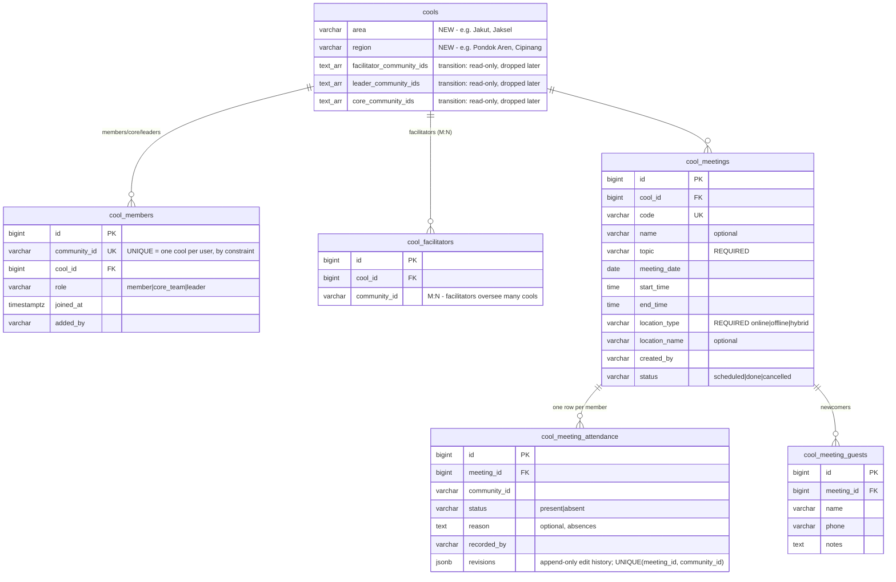

# COOL Management & Unified Permissions — Design

**Date:** 2026-07-07
**Status:** Approved design, pre-implementation
**Repo:** go-community — evolves the existing v2 COOL domain in place
**Related specs:** `2026-07-07-user-management-design.md` (permission engine origin — §2 there is *extended* by §2 here), `2026-07-07-event-management-v3-design.md` (amended by §7 here)

---

## 1. Goal & Principles

Complete the COOL module — management (members, roles, area/region), meetings + attendance, new-joiner capture, analytics — on top of a **single permission engine shared by users, cools, and events**: actions fixed in code, grants editable at runtime, grantable to roles, individual people, or cool-roles, at global or per-resource scope.

**Principles:**

1. **One permission engine for three modules.** `Can(actor, action, resource)` is the only authorization question anywhere. Office standards are seeded grants; per-cool and per-event needs are override grants. One grants API, one future permissions UI.
2. **Membership is one row, not three writes.** `cool_members` replaces the arrays-on-cool + `users.cool_id` dual-write (the checklist's "Base Part 1/Part 2" pain). One-cool-per-user becomes a DB constraint.
3. **DB-console friendly.** Engineers still work directly in the database: tables use plain readable columns, the migration backfills automatically in pure SQL (idempotent, zero manual steps), and a `v_cool_roster` view shows the roster like a spreadsheet.
4. **Modules correlate through shared data.** COOL membership feeds event eligibility (cool-exclusive events, must-have-a-cool rules); user attributes (department) feed COOL analytics cross-tabs; one `cool_members` source of truth serves all dashboards.
5. Same house rules as the sibling specs: `Atomic`-only transactions, herr bilingual EN/ID errors, configdb tunables, audited mutations.

**Out of scope:** frontend, WhatsApp notifications for meetings, QR check-in for cool meetings (manual roster is right for small groups; the universal QR `cool_join` action remains a future consumer), migrating `cool_new_joiners` (unchanged, deliberately separate — see §5.4).

---

## 2. Unified Permission Engine

Extends the user-management spec's `permission_grants`; this section is the authoritative shape.

### 2.1 Grants table (extended)

```
permission_grants
├─ id
├─ subject_type   role | user | cool_role        ← cool_role ∈ leader|core_team|facilitator
├─ subject_ref    "gco-admin" | <community_id> | "leader"
├─ action         from the code-defined catalogs (§2.2)
├─ resource_type  global | cool | event
├─ resource_ref   NULL | <cool_id> | <event_code>
├─ scope          all | own_departments | own_cool | list   (for global-resource subjects)
├─ scope_refs     TEXT[]
├─ granted_by, created_at
```

Semantics:

- `subject_type=cool_role` + `resource_type=global` = **office standard**: "every leader, in their own cool, may X". The actor's cool is resolved from `cool_members`/`cool_facilitators` at evaluation time.
- `subject_type=cool_role` + `resource_type=cool` = **per-cool override**: "in COOL 12, core team may also add members".
- `subject_type=user` + `resource_type=event` = **per-event manager**: "this person may `event.checkin` at XMAS25 only".
- Layering: global standards apply first; resource-pinned grants ADD capabilities for that resource. (Grants only add; removing an office standard for one cool = delete the standard, seed per-cool grants instead — no deny rules, keeps evaluation trivially auditable.)

### 2.2 Action catalogs (fixed in code)

| Module | Actions |
|---|---|
| Users (from user-mgmt spec) | `user.view_basic`, `user.view_full`, `user.manage`, `user.activate`, `user.audit.view`, `user.dashboard.view`, `permission.manage` |
| COOL | `cool.view`, `cool.members.view`, `cool.members.add`, `cool.members.remove`, `cool.roles.change`, `cool.edit`, `cool.create`, `cool.meetings.create`, `cool.attendance.record`, `cool.attendance.edit`, `cool.attendance.view`, `cool.stats.view`, `cool.manage_all` |
| Events | `event.view_internal`, `event.manage`, `event.checkin`, `event.attendees.view`, `event.reports.view`, `event.manage_all` |

### 2.3 Seeded office standard (migration data)

| Subject | Actions | Resource/scope |
|---|---|---|
| cool_role: leader | members.view/add/remove, roles.change, edit, meetings.create, attendance.record/edit/view, stats.view | own cool (derived) |
| cool_role: core_team | members.view, meetings.create, attendance.record/view | own cool |
| cool_role: facilitator | everything leader has + cool.view list | every cool they facilitate |
| role: gco-admin, superadmin | cool.manage_all, cool.create, event.manage_all | global |
| role: event-admin (existing) | event.manage_all | global |

Superadmin hardcoded bypass and grant-change audit logging carry over from the user-mgmt spec unchanged.

### 2.4 Evaluator

```go
Can(actor Actor, action string, res Resource) (allowed bool, meta Meta)
// Resource{Type: "cool"|"event"|"global", Ref: "12"|"XMAS25"|""}
// Meta carries FieldSet (user actions) / nothing (cool, event)
```

- Actor context loads once per request: roles, user_types, cool membership+role, facilitated cool ids, led departments. Grants cached 60s; `permission.manage` and `user.manage` bypass cache.
- List endpoints get scope filters as SQL predicates (facilitator's cool list = `cool_id IN (facilitated)`), never post-filtering.
- Exhaustive matrix unit tests: every seeded subject × every action × in/out-of-resource.

---

## 3. COOL Data Model



**Key decisions:**

- **`cool_members.community_id UNIQUE`** — the "kalo user udah punya cool, harus di-delete dulu" rule enforced by the database, not by remembering to check. Moving cools = one UPDATE (or delete+insert through the API). Promotions ("edit user type dari member jadi leader") = one UPDATE of `role`.
- **Facilitators are NOT `cool_members`** — genuinely many-to-many (`cool_facilitators`), so a facilitator can also be a *member* of their own cool independently of facilitating others.
- **Attendance edits** append `{at, by, changes}` to `revisions` — audited corrections by recorder-roles, per decision.
- **Guests stay separate from `cool_new_joiners`** — you want source attribution: form-pipeline joiners vs meeting walk-ins are different origins and stay distinct lists.

**Migration (one idempotent SQL script, zero manual steps):**

1. `ALTER cools ADD area, region` (nullable).
2. Backfill `cool_members` by unnesting `leader_community_ids`/`core_community_ids` (role leader/core_team) plus every `users.cool_id` holder not already inserted (role member). Conflicts on the UNIQUE constraint resolve keep-first (leaders win over member rows).
3. Backfill `cool_facilitators` from `facilitator_community_ids`.
4. Create view `v_cool_roster` — `SELECT cool name, member name, role, phone_number, joined_at` ordered by cool — the DB-console spreadsheet.
5. Transition: arrays + `users.cool_id` become read-only mirrors maintained by the usecase on every membership write (single code path), so old endpoints/queries keep working; dropped in a later cleanup migration once the frontend migrates.

---

## 4. Features

### 4.1 COOL CRUD — `cool.create` / `cool.edit` / `cool.manage_all`
Create with: name, description, campus, category, gender (male/female/hybrid), recurrence (monthly/weekly, free-form text as today), location type/name, **area + region**, facilitators, leaders, core team. **Facilitator assignment/removal requires `cool.manage_all`** (admin-side only — a facilitator cannot self-assign, and a leader's `cool.edit` covers descriptive fields but never the facilitator list). Edit = PATCH; lists scoped by the engine (admin all, facilitator theirs).

### 4.2 Member management — `cool.members.*`, `cool.roles.change`
- Add member/core/leader (facilitators: admin-only, §4.1): validates the target has no existing cool (`ALREADY_IN_COOL` herr error, bilingual humanized: "This person is already part of COOL X. Remove them there first." / "Orang ini sudah tergabung di COOL X. Keluarkan dari sana terlebih dahulu.").
- Remove: one delete; role change: one update. All membership mutations write `user_audit_logs` rows (action `cool.member_added` etc.) — same audit table as user management.
- Who can do which is entirely grants: office standard says leaders add/remove/promote and cores only view; any cool can be overridden.

### 4.3 Meetings — `cool.meetings.create`
Create (leader/core/facilitator per grants): cool, optional name, **required topic**, date, start/end time, **required location type**, optional location name. Attendance can be recorded immediately ("mau attendancenya skrg") or later ("atau nanti") — the meeting exists independently of its attendance. Members see upcoming + past meetings of their cool plus their cool's info page.

### 4.4 Attendance — `cool.attendance.record` / `.edit` / `.view`
- Recording: full roster listed; per member present/absent + optional reason; guests (name, phone, notes) captured on the same submission.
- Editing: recorder-roles of that cool may correct afterward; every edit appends to `revisions`.
- **History window:** non-admin queries are capped at configdb `cool.attendance_window_months` (default 6); `cool.manage_all` holders bypass.
- Views: per-meeting (who came, who didn't, totals + rate), per-member over a range (attended X of Y meetings, overall percentage), per-cool overall.

### 4.5 Analytics — `cool.stats.view` (leaders: own cool; facilitators: theirs; admin/GCO: all)
- **Member growth**: members over time (from `joined_at` / audit history).
- **COOL growth**: count of active cools over time ("berapa cool yang ada di certain times").
- **Category spread**: member distribution by cool category.
- **Quarterly attendance report** (the normalization you specified): monthly rate = `min(meetings_attended_in_month, 3) / 3` — a month with 2 meetings still divides by 3; a month with 4+ caps the numerator at 3 (extra attendance never exceeds 100%). Quarterly rate = sum of three capped monthly numerators / 9. Computed per member and rolled up per cool.
- **Department cross-tab**: attendance rates grouped by the member's department (`user_departments` from the user-mgmt spec — cross-module spine).

### 4.6 New joiners — unchanged pipeline, correlated view
`cool_new_joiners` (form pipeline) stays as-is. Meeting guests are a separate origin. A single admin read endpoint lists both with a `source` discriminator (`form` | `meeting`) so GCO sees the whole funnel while origins stay distinguishable.

---

## 5. Cross-Module Correlation

### 5.1 COOL membership as event eligibility (amends events-v3 spec §2.2)

`eligibility.rules` gains three optional fields, same any-match OR semantics:

```json
"rules": {
  "cools": [12, 14],                    // cool-exclusive: members of these cools
  "requires_cool_membership": true,     // must belong to SOME cool
  "cool_roles": ["leader", "core_team"] // e.g. leaders-only retreat
}
```

`eligibility.Check` gains the corresponding inputs on its `User` context (cool id + cool role), loaded from `cool_members`.

### 5.2 Event permissions through the engine (amends events-v3 spec §§2.1, 7.1, 9)

- The `event_organizers` table is **removed from the events-v3 design**; per-event staff become `permission_grants` rows (`subject=user, action=event.checkin|event.manage, resource=event:<code>`).
- The events plan's `requireStaff(eventCode)` helper and the QR registry's `Allowed` callbacks become `Can(actor, "event.checkin", Resource{event, code})`.
- `POST /v3/events/{code}/organizers` is replaced by the generic grants API filtered to that resource — one UI pattern for "share this event" and "share this cool", Google-Sheets style.

### 5.3 Build-order note
Whichever plan is implemented first **builds the engine** (`internal/pkg/permission` with the extended schema of §2.1); the others consume it. The user-mgmt spec's §2 is subsumed by this section — its seeds and actions stand, its table gains the resource columns.

---

## 6. API Surface

Under `/api/v2`, existing JWT middleware, evaluator-gated. Errors: herr, bilingual EN/ID.

```
── COOL (member) ─────────────────────────────────────────────
GET  /v2/cools/mine                        my cool info page
GET  /v2/cools/mine/meetings               upcoming + past

── COOL (grants-gated) ───────────────────────────────────────
GET    /v2/cools                           scoped list (admin all / facilitator theirs / leader own)
POST   /v2/cools                           create (cool.create)
GET    /v2/cools/{id}                      detail + roster (cool.members.view)
PATCH  /v2/cools/{id}                      edit incl. area/region/facilitators (cool.edit)
POST   /v2/cools/{id}/members              add {community_id, role} (cool.members.add / roles gate)
PATCH  /v2/cools/{id}/members/{communityId}  change role (cool.roles.change)
DELETE /v2/cools/{id}/members/{communityId}  remove (cool.members.remove)
POST   /v2/cools/{id}/meetings             create meeting (cool.meetings.create)
GET    /v2/cools/{id}/meetings             list
POST   /v2/meetings/{code}/attendance      record roster + guests (cool.attendance.record)
PATCH  /v2/meetings/{code}/attendance      corrections, audited (cool.attendance.edit)
GET    /v2/meetings/{code}/attendance      per-meeting view (cool.attendance.view)
GET    /v2/cools/{id}/attendance/members   per-member rates over range (window rule)
GET    /v2/cools/{id}/stats                growth, spread, quarterly report (cool.stats.view)
GET    /v2/cools/stats                     global analytics (cool.manage_all)
GET    /v2/new-joiners?source=form|meeting combined funnel view

── Permissions (shared engine) ───────────────────────────────
GET/POST/DELETE /v2/permissions/grants     now accepts cool_role subjects + cool/event resources
```

## 7. Configdb Keys

```
cool.attendance_window_months     6      (non-admin history cap)
cool.max_members                  0      (0 = unlimited; future-proofing, not enforced by PRD)
```

## 8. Testing Strategy

- **Unit:** evaluator matrix incl. cool_role subjects, per-resource overrides, facilitator multi-cool resolution; quarterly-report math (2-meeting month, 4-meeting month, cross-month member moves); one-cool constraint error mapping.
- **Integration:** migration backfill from seeded legacy arrays (leaders win conflicts); add/remove/promote member single-write + mirror sync + audit rows; meeting → attendance-now and attendance-later flows; attendance edit revisions; window cap for non-admin vs admin bypass; scoped cool lists per role; cool-eligibility check for events (unit against `eligibility.Check` extended inputs).
- **Bilingual gate:** new herr classes (`ALREADY_IN_COOL`, `NOT_COOL_MEMBER`, `ATTENDANCE_WINDOW_EXCEEDED`, `MEETING_ALREADY_RECORDED`, ...) pass the EN/ID completeness test.

## 9. Rollout

1. Ship migration + engine (grants schema incl. resource columns) + seeds; verify `v_cool_roster` matches legacy arrays 1:1 in staging.
2. Enable member management + scoped lists for facilitators/GCO; legacy arrays kept mirrored.
3. Meetings + attendance for a pilot batch of cools; then all.
4. Analytics + quarterly report once ~1 quarter of attendance data exists.
5. Drop legacy array columns + `users.cool_id` after frontend migration (cleanup migration).
