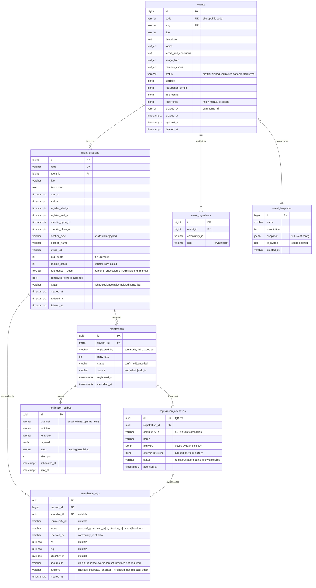
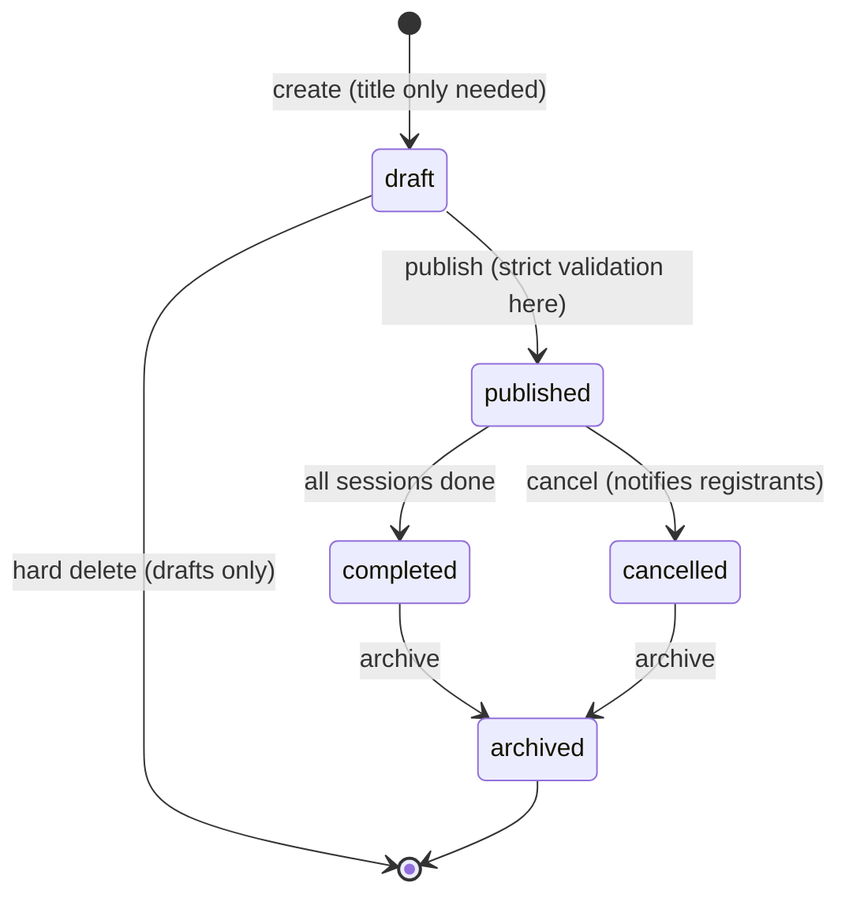
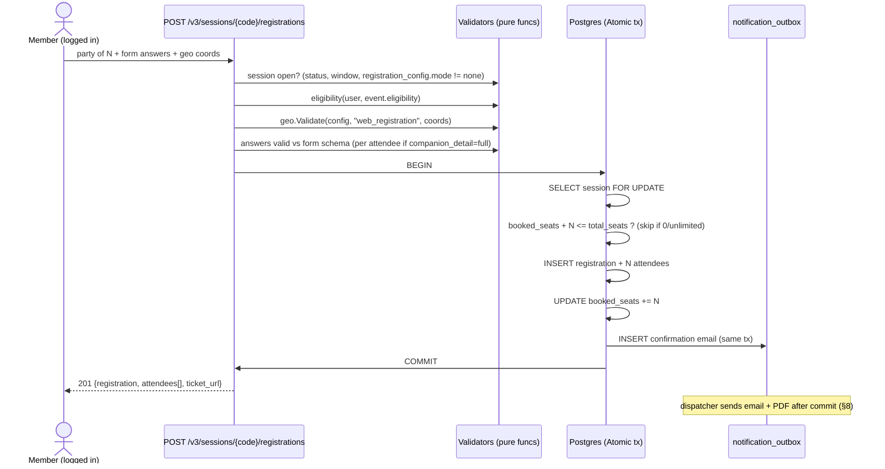
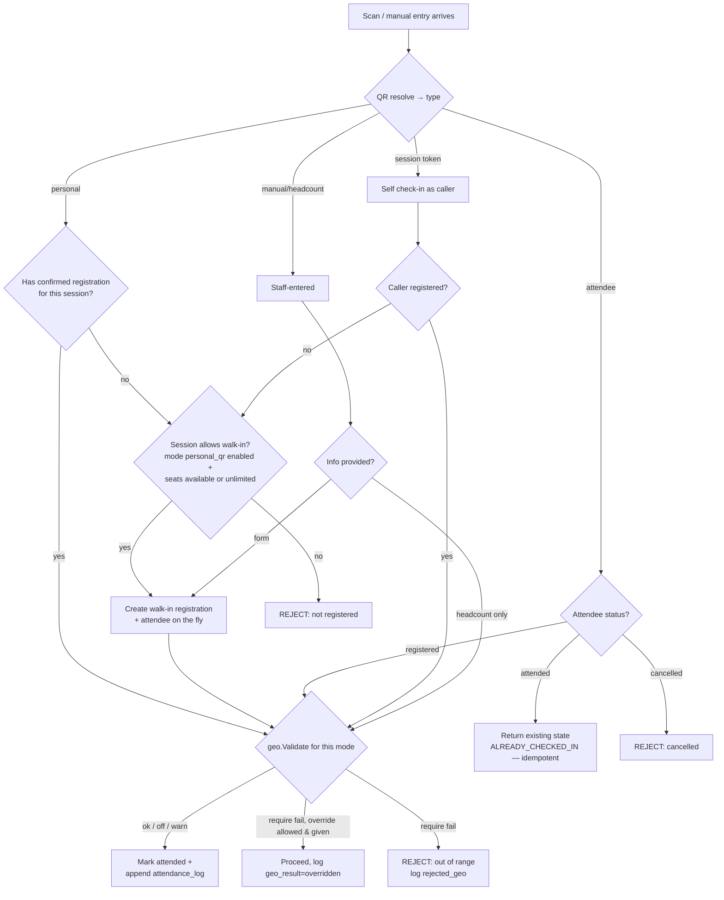
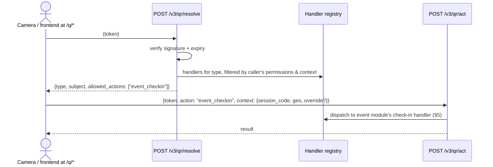
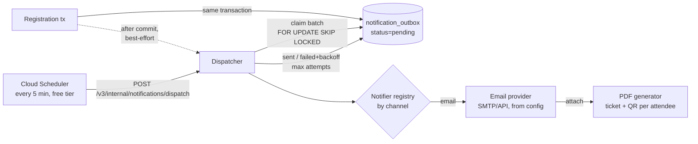

# Event Management v3 — Design

**Date:** 2026-07-07
**Status:** Approved design, pre-implementation
**Repo:** go-community (`/api/v3`, new module alongside v2)

---

## 1. Goal & Principles

Revamp event management to prioritize **flexibility** while keeping the system **elegant** and **staff-friendly**. One model must express: a single event, a conference, a Christmas event with 3 sessions, a weekly/monthly recurring series, or a pure information page — with per-event control over who can attend, what data is collected, how people check in, and where they must physically be.

**Design principles:**

1. **One mechanism per concept, no special cases.** Name/email/phone/NIK are just built-in form field types; custom questions use the same form system. A weekly series is just an event whose sessions are auto-generated. Walk-ins are just registrations created at the door.
2. **Relational spine + JSONB config.** Tables where transactional integrity matters (seats, registrations, attendance); typed JSONB where policy flexibility matters (forms, modes, geo, eligibility, recurrence). New rule types never require migrations.
3. **Free-tier safe.** Supabase free Postgres (~500MB, pooled connections) + GCP free scheme. No always-on background workers — all async work is DB-backed and triggered by requests or Cloud Scheduler.
4. **Staff can't get lost.** Drafts with late validation, templates, computed human-readable state on every response, specific error messages.
5. **QR is a universal subsystem** (single domain), not an event feature. Event check-in is its first consumer; COOL joining etc. plug in later without format changes.

**Explicit non-goals:**

- No payments, ever (free events only).
- No migration of v2 data — old events live out their life on v2 read-only; all new events on v3.
- No new permission scheme — reuse existing RBAC (roles/user-types, superadmin bypass) plus a lightweight per-event organizer list.
- Email is the only notification channel at launch (architecture keeps WhatsApp/SMS pluggable).
- API-only; frontend is a separate repo.

**Scale context:** ~1,000 users total. Correctness and clarity beat premature optimization everywhere.

---

## 2. Domain Model

### 2.1 Entity–relationship diagram



Notes:

- `attendance_logs` is the **append-only audit truth** — never updated, never deleted. `registration_attendees.status` is the convenient projection derived from it.
- **All four time windows are per-session**: event dates (`start_at`/`end_at`), registration window (`register_start_at`/`register_end_at`), and check-in/verification window (`checkin_open_at`/`checkin_close_at`). The event's overall period is derived from its sessions (earliest start → latest end), never stored separately.
- Every attendee gets their **own row and own QR**, even inside one party — individual door verification always works.
- All v3 tables are new; v2 tables (`events`, `event_instances`, `event_registration_records`, `event_questions`) are untouched. v3 table names carry no prefix collision because the v2 names differ (`event_sessions` vs `event_instances`, `registrations` vs `event_registration_records`).

### 2.2 JSONB config schemas

All configs are Go structs marshalled to JSONB — validated in Go at write time (draft saves validate loosely; publish validates strictly, see §7.2).

**`eligibility`** — who may register (viewing is always public, including guests):

```json
{
  "audience": "everyone | members | rules",
  "rules": {
    "roles": ["worship-team"],
    "user_types": ["volunteer"],
    "campuses": ["BKS"],
    "community_ids": ["1234567890"]
  }
}
```

Semantics: `everyone` = any logged-in user (guests can view but must sign in to register — global rule). `members` = any logged-in user (alias kept for clarity in admin UI). `rules` = user matches if they match **any** non-empty list (OR across lists, OR within a list).

**`registration_config`** — whether/what/how many:

```json
{
  "mode": "none | required | optional",
  "max_per_registration": 3,
  "allow_multiple_registrations": false,
  "companion_detail": "full | count_only",
  "edit_policy": {
    "enabled": true,
    "until": "register_end | checkin_open | session_start | never",
    "fields": "all"
  },
  "form": [
    { "key": "name",  "type": "name",  "label": "Full name", "required": true,
      "answered_by": "everyone" },
    { "key": "phone", "type": "phone", "label": "Phone", "required": false,
      "answered_by": "primary" },
    { "key": "nik",   "type": "nik",   "label": "NIK", "required": false,
      "answered_by": "primary" },
    { "key": "diet",  "type": "select", "label": "Dietary needs",
      "options": ["none", "vegetarian", "allergy"], "required": true,
      "answered_by": "everyone" },
    { "key": "child_consent", "type": "checkbox", "label": "Guardian consent",
      "required": true, "answered_by": "companions" },
    { "key": "allergy_detail", "type": "text", "label": "Describe your allergy",
      "required": true, "answered_by": "everyone",
      "show_if": { "field": "diet", "op": "eq", "value": "allergy" } }
  ]
}
```

**Who answers each field — `answered_by`.** Every field independently declares its audience:

- `primary` (default) — only the registrant answers; companions never see it.
- `everyone` — the registrant answers it for themselves AND each companion answers it (or the registrant fills it on their behalf).
- `companions` — only companion seats answer it (e.g., guardian consent for accompanied children); the primary skips it.

`required` applies within that audience only. Combined with `show_if`, this supports shapes like "companions under 12 must have a consent checkbox" without special cases. The party-level `companion_detail: count_only` short-circuits all of it — companions are name-only rows regardless of field audiences.

**Conditional (branching) questions — `show_if`.** Any field may carry a condition tree deciding whether it is shown, evaluated against the same attendee's other answers:

```json
"show_if": { "field": "diet", "op": "eq", "value": "allergy" }

"show_if": { "any": [
  { "field": "diet", "op": "in", "value": ["vegetarian", "allergy"] },
  { "all": [
    { "field": "age", "op": "lt", "value": 12 },
    { "field": "parent_name", "op": "answered" }
  ]}
]}
```

- Leaf operators: `eq`, `neq`, `in`, `not_in`, `answered`, `not_answered`, `gt`, `gte`, `lt`, `lte`, `contains`. Branch combinators: `all` (AND), `any` (OR) — nestable to any depth.
- A hidden field's `required` is ignored, and any answer submitted for it is **dropped server-side** — visibility is re-evaluated on the server, never trusted from the client.
- Publish-time validation rejects condition cycles (`a` depends on `b` depends on `a`) and references to unknown field keys.
- The evaluator is one pure function (`form.Visible(field, answers)`) shared by validation, and the resolved visibility per field ships in the event-detail response so the frontend renders branching without re-implementing logic.

**Editing answers after registration — `edit_policy`.** The registrant (or an organizer, any time) can update answers via `PATCH /v3/registrations/{id}/attendees/{attendee_id}` while the policy window is open:

- `until` anchors the deadline to a session milestone; `never` disables self-editing entirely.
- `fields: "all"` or an explicit list of editable keys (e.g., let people change `diet` but never `nik`).
- Edits re-run full form validation including `show_if` (changing a controlling answer drops now-hidden answers and may newly require others).
- Party size and session are **not** editable — cancel and re-register instead (keeps seat accounting trivial).
- Every edit appends the previous `answers` snapshot to an `answer_revisions` JSONB array on the attendee row — organizers can always see what changed, without a new table.

- `mode: none` → **information-only event**: page renders, no registration endpoints active, no counters.
- `max_per_registration`: `1` = one person only, `N` = party up to N, `0` = unlimited.
- `companion_detail: full` → companions answer the form fields whose `answered_by` audience includes them; `count_only` → companions are just names (auto-numbered "Guest of X" if blank).
- **`name` is the only default field** and the only one that is always present. Email, phone, NIK, and custom questions are each independently togglable for visibility and requiredness.
- Built-in field types: `name`, `email`, `phone`, `nik`, `text`, `textarea`, `number`, `select`, `multiselect`, `checkbox`, `date`. Typed fields get format validation for free (email format, Indonesian phone format, 16-digit NIK).

**`geo_config`** — location validation policy (shape owned by this design, per-mode like the original reference but simplified):

```json
{
  "enabled": true,
  "venue": { "lat": -6.2, "lng": 106.816666, "radius_m": 100 },
  "modes": {
    "web_registration": { "check": "off | warn | require" },
    "personal_qr":      { "check": "require", "staff_override": true },
    "session_qr":       { "check": "require", "staff_override": false },
    "registration_qr":  { "check": "off",     "staff_override": true },
    "manual":           { "check": "warn",    "staff_override": true }
  }
}
```

- One knob per mode: `off` (don't check), `warn` (check, record violations, allow), `require` (block if outside radius or coords missing).
- `staff_override` lets the acting staff pass `override: true` to proceed on a `require` failure — always recorded as `geo_result: overridden` with the actual coords.
- Applies at **both** registration (the `web_registration` mode) and check-in (the other four).
- Distance = Haversine in Go. No PostGIS. Coordinates + reported accuracy are stored as evidence in `attendance_logs`; they are never blindly trusted.

**`recurrence`** — session auto-generation rule (`null` = sessions created manually):

```json
{
  "freq": "weekly | monthly | custom_days",
  "interval": 1,
  "by_day": ["SUN"],
  "by_month_day": [1],
  "custom_dates": ["2026-12-24", "2026-12-25"],
  "session_defaults": { "start_time": "09:00", "duration_min": 120, "total_seats": 0 },
  "until": "2026-12-31",
  "generate_ahead": 4
}
```

Sessions are always **materialized rows** — recurrence only generates them (§6). Editing/cancelling an individual generated session sticks; regeneration is idempotent and never overwrites edited rows.

---

## 3. Event lifecycle



- **Draft** requires only a title. Staff fill in config gradually; loose validation (types only).
- **Publish** runs strict validation: at least one session, coherent dates, valid form schema, eligibility/geo configs well-formed. Errors are specific and human ("session 2: registration closes after the session starts").
- Deleting anything published is **soft** (archive). Hard delete exists only for drafts.

---

## 4. Registration flow



Rules:

- **Auth always required to register** (global). Guests can view any event page but must sign in to act.
- **Duplicate guard:** one `confirmed` registration per (`session_id`, `registered_by`) unless `allow_multiple_registrations: true`. Companions are not dedup-checked (guest companions have no identity).
- **Seat integrity:** check + increment inside one transaction with `SELECT ... FOR UPDATE` on the session row, via the repository `Atomic` helper (the tx-scoped-repository pattern — deliberately *not* v2's `Transaction` helper, which has a known scoping bug; see `wiki/entities/competing-transaction-abstractions.md`).
- **Cancellation** (`DELETE /v3/registrations/{id}`): sets status, decrements `booked_seats` by remaining non-attended party size, frees seats atomically the same way.

---

## 5. Check-in

### 5.1 The four modes

Any combination can be enabled per session via `attendance_modes[]`. (Whether people can register in advance is a separate knob — `registration_config.mode`; enabling `registration_qr` only makes sense when registration is on.)

| Mode | Actor | What is scanned/entered | Typical use |
|---|---|---|---|
| `personal_qr` | Staff device | Member's personal QR (community ID) | Weekly service — flash your QR |
| `session_qr` | Attendee's phone | Poster QR at the venue (session token) | Self check-in, geo enforces presence |
| `registration_qr` | Staff device | Attendee QR from the PDF ticket | Ticketed events (Christmas, conference) |
| `manual` | Staff desk | Typed form (walk-in) or bare `+1` headcount | No-phone attendees, overflow counting |

### 5.2 Decision flow



- **Every path — success or rejection — appends an `attendance_logs` row** with mode, actor, coords, geo result, outcome. The log is the audit trail; nothing edits it.
- **Idempotency:** re-scanning an attended QR returns the existing state with `ALREADY_CHECKED_IN`; it never double-counts, never errors the scanner flow.
- **Headcount taps** create a log row with null attendee/community — counted in reports as anonymous walk-ins.
- **Staff authorization:** staff modes require the caller to be an `event_organizer` of the event (owner/staff) or hold the global event-admin RBAC role (superadmin bypass applies as everywhere).

---

## 6. Universal QR subsystem

QR is its own bounded domain (`internal/pkg/qr` + `internal/usecases/qr`), not an event feature. Event check-in is the first registered consumer; future consumers (COOL joining, form links) add handlers without touching the QR core.

### 6.1 Format — one URL shape for every QR the system ever emits

```
https://<app-domain>/q/<token>
```

`token` = base64url(payload) + HMAC-SHA256 signature. Payload:

```json
{ "t": "personal | attendee | session", "r": "<reference>", "iat": 1751850000, "exp": null }
```

- `personal` → `r` = community ID, never expires.
- `attendee` → `r` = attendee UUID, expires after the session ends.
- `session` → `r` = session code (the poster QR), expires at `checkin_close_at`.
- New types (`cool_join`, …) are added to a registry — **format, endpoint, and scanner never change**.
- HMAC key from config (same per-`kid` secret map pattern as auth). Signature blocks forged/tampered QRs.

### 6.2 Resolve/act API



`allowed_actions` is computed per caller: a staff member scanning a personal QR during an active session they organize sees `event_checkin`; a random member scanning their friend's QR sees nothing actionable. When COOL joining ships, the same personal QR starts offering `cool_join` — the printed/saved QR never changes.

The `qr` package owns: token encode/decode/sign/verify, PNG rendering (for PDFs and API responses), and the action-handler registry.

---

## 7. Staff experience

### 7.1 Templates

- `event_templates` stores a **complete event config snapshot** (all four JSONB configs + session defaults + modes).
- `POST /v3/events/from-template/{id}` with just `{title, first_session_date}` → fully configured draft.
- Seeded system templates: **Sunday Service** (personal QR, no form), **Conference** (self-registration, per-attendee form, registration QR), **Weekly Class** (recurring weekly, members-only), **Announcement** (info-only).
- `POST /v3/events/{code}/save-as-template` and `POST /v3/events/{code}/duplicate`.

### 7.2 Create/edit/delete ergonomics

- Create with title only → draft. Strict validation at **publish** (§3), loose at save. Staff never fight half-filled forms.
- All updates are partial `PATCH`. Sessions accept **bulk create** (array in one call).
- Soft delete (archive) everywhere; hard delete for drafts only.
- Validation errors name the exact field and problem — never generic `INVALID_INPUT`.

### 7.3 Anti-confusion: computed state on every response

Every event/session response embeds derived, human-meaningful state so the frontend and staff never re-derive logic:

```json
{
  "availability": "open | full | opens_soon | closed | walk_in_only | info_only",
  "seats": { "total": 500, "booked": 342, "remaining": 158 },
  "active_modes_now": ["registration_qr", "manual"],
  "checkin_window": { "open": true, "closes_at": "..." }
}
```

Plus `GET /v3/staff/dashboard`: events I organize, today's sessions, live check-in counts — the staff home screen in one call.

### 7.4 Reports — CSV & XLSX

- `GET /v3/events/{code}/report?format=csv|xlsx` and `GET /v3/sessions/{code}/report?...`
- **Custom form answers flatten into columns** (one column per form field key).
- **XLSX** (via `excelize`): Summary sheet (per session: registered, attended, no-show, walk-ins, headcount, attendance %, geo violations) + one detail sheet per session (attendee rows). **CSV**: flat attendee list for quick import elsewhere.
- Streamed in the response, never stored. At ~1,000 users, size is a non-issue.
- Access: event organizers + event-admin RBAC.

---

## 8. Notifications & PDF tickets

### 8.1 Pipeline (free-tier safe: DB-backed outbox, no resident worker)



- Outbox row written **in the registration transaction** — a confirmation can never be lost even if the process dies right after commit.
- Dispatcher is triggered twice: opportunistically right after the request (fast path) and by **Cloud Scheduler** hitting an API-key-protected internal endpoint (safety net — free tier includes 3 jobs). Batch claiming uses `FOR UPDATE SKIP LOCKED` so concurrent dispatches never double-send.
- Retries with exponential backoff, capped attempts, `failed` rows visible to admins.
- **`Notifier` interface**, one email implementation now (provider + credentials in YAML config). WhatsApp/SMS later = new implementation + `channel` value; zero schema change.
- Notifications sent on: registration confirmed, registration cancelled, event cancelled (all registrants).

### 8.2 PDF ticket

- Generated in Go (`gofpdf`/`maroto`) **at send time**, and on demand at `GET /v3/registrations/{id}/ticket.pdf` (owner or organizer only) — never stored.
- Contents: event title + image, session date/time/location, party summary, **one QR per attendee** (universal `attendee` tokens, §6), short how-to-use text.

### 8.3 Recurring session generation

Same Cloud Scheduler tick calls `POST /v3/internal/sessions/generate`:

- For each published event with a recurrence rule: materialize sessions up to `generate_ahead` periods, computed **deterministically** from the rule (freq/interval/by_day/until + session_defaults).
- **Idempotent** — a unique key (`event_id`, occurrence date) means re-runs insert nothing new.
- Staff edits to a generated session persist (generation never updates existing rows); cancelling one occurrence just cancels that session.
- Rule changes affect only future, not-yet-generated sessions.

---

## 9. API surface

All under `/api/v3`, mounted beside v1/v2 in the existing Echo composition (`internal/deliveries/http`), reusing `GeneralMiddleware` and `UserMiddleware` chains.

```
── Public (guests OK — view only) ──────────────────────────────
GET    /v3/events                          published events, cursor-paginated, filters (campus, topic, date)
GET    /v3/events/{code}                   detail + sessions + form schema + computed state

── Authenticated (member) ──────────────────────────────────────
POST   /v3/sessions/{code}/registrations   register self + companions
GET    /v3/me/registrations                my registrations (upcoming/past)
DELETE /v3/registrations/{id}              cancel own registration
PATCH  /v3/registrations/{id}/attendees/{attendee_id}   edit answers (per edit_policy; organizers any time)
GET    /v3/registrations/{id}/ticket.pdf   (re)download ticket — owner or organizer
POST   /v3/qr/resolve                      what is this QR + my allowed actions
POST   /v3/qr/act                          perform an action (self check-in via session QR, etc.)

── Staff (event organizer or event-admin RBAC) ─────────────────
POST   /v3/sessions/{code}/checkin         staff check-in: personal_qr / registration_qr / manual / headcount
GET    /v3/sessions/{code}/attendees       attendee list, search, status filter, live counts
GET    /v3/staff/dashboard                 my events, today's sessions, live counts
GET    /v3/events/{code}/summary           per-session stats
GET    /v3/events/{code}/report            ?format=csv|xlsx
GET    /v3/sessions/{code}/report          ?format=csv|xlsx

── Admin (event-admin RBAC) ────────────────────────────────────
POST   /v3/events                          create draft (title is enough)
PATCH  /v3/events/{code}                   partial update
POST   /v3/events/{code}/publish           strict validation gate
POST   /v3/events/{code}/cancel            cancel + notify registrants
DELETE /v3/events/{code}                   archive (hard delete: drafts only)
POST   /v3/events/{code}/sessions          create sessions (single or bulk array)
PATCH  /v3/sessions/{code}                 partial update
DELETE /v3/sessions/{code}                 cancel/archive session
POST   /v3/events/{code}/organizers        assign owner/staff
GET    /v3/templates                       list (system + own)
POST   /v3/events/from-template/{id}       one-call creation
POST   /v3/events/{code}/save-as-template
POST   /v3/events/{code}/duplicate

── Internal (Cloud Scheduler, API-key protected) ───────────────
POST   /v3/internal/notifications/dispatch
POST   /v3/internal/sessions/generate
```

---

## 10. Code structure & conventions

Follows the existing layered architecture (see `AGENTS.md` / `wiki/`), with v3-specific improvements:

```
internal/
  models/v3/            v3 entities + JSONB config structs + request/response DTOs
  repositories/pgsql/   new repos: event_v3, session_v3, registration_v3, attendance_v3,
                        outbox, template, organizer  (registered in PostgreRepositories)
  usecases/v3/          eventUsecase, registrationUsecase, checkinUsecase,
                        qrUsecase, notificationUsecase, reportUsecase, templateUsecase
  deliveries/http/v3/   handlers, mounted in main_handler.go beside v1/v2
  pkg/qr/               universal QR: token codec, HMAC, PNG render, handler registry
  pkg/geo/              Haversine + policy evaluation (pure)
  pkg/pdfticket/        ticket PDF generation
  pkg/notify/           Notifier interface + email implementation
```

**Deliberate v3 conventions (fixing v2 tech-debt flagged in `wiki/`):**

1. **Typed errors, not the sentinel switch.** v3 errors are a struct carrying HTTP status + code + message; one declaration site per error. No additions to the giant `ErrorMapping` switch.
2. **Transactions via `Atomic` only** (tx-scoped repositories). The buggy `Transaction`-wrapper pattern is banned in v3 code.
3. **One dependency style:** every v3 usecase takes the `PostgreRepositories` aggregate + config — no 7-interface constructors.
4. **Validators are pure functions** (`eligibility.Check`, `form.Validate`, `geo.Validate`, recurrence expansion) — unit-testable without DB or HTTP.

**New dependencies:** `excelize` (XLSX), `gofpdf` or `maroto` (PDF), `skip2/go-qrcode` (QR PNG). All pure-Go, no CGO, free.

**Config additions (`config/*.yaml`):** email provider block (host/key/from), QR HMAC secret map, app public domain for `/q/` URLs.

---

## 11. Concurrency, integrity & failure handling

| Concern | Mechanism |
|---|---|
| Two people grab the last seat | `SELECT ... FOR UPDATE` on session row; check+increment in one `Atomic` tx |
| Double-scan of a QR | Idempotent: returns existing state (`ALREADY_CHECKED_IN`), logged, never double-counted |
| Concurrent outbox dispatchers | `FOR UPDATE SKIP LOCKED` batch claiming |
| Lost confirmation email | Outbox row written in the registration transaction; Cloud Scheduler retries |
| Recurrence double-generation | Unique (`event_id`, occurrence date); inserts are no-ops on conflict |
| Forged/tampered QR | HMAC signature verification |
| GPS spoofing | Not fully preventable client-side; coords + accuracy stored as evidence, staff override is logged, `warn` mode available where trust is enough |
| Supabase connection limits | Use pooled connection string (Supavisor); GORM pool sized small (free tier ~default 15) |
| Cancelled event with registrants | Cancellation fan-outs notifications via outbox; seats/status updated in tx |

---

## 12. Testing strategy

- **Unit (pure, exhaustive):** form validation per field type, `show_if` evaluator (nested all/any, every operator, cycle detection, hidden-answer dropping), eligibility matrix (audience × rules), geo policy (inside/outside/missing/override per mode), recurrence expansion (weekly/monthly/custom, until, edited-session preservation), QR token codec (sign/verify/expiry/tamper).
- **Integration (DB, per flow):** registration happy path + seat exhaustion race (two concurrent registrations, one seat), duplicate guard, cancellation refund of seats, answer editing within/outside the edit_policy window incl. revision history, each of the 4 check-in modes end-to-end incl. walk-in auto-creation and idempotent re-scan, outbox claim/retry, report generation with custom-question columns.
- **Migration tests:** v3 tables in `tests/integration/db/migrations/` following the existing numbering convention.
- Existing repo has no test suite yet — v3 introduces one; scope is v3 code only.

---

## 13. Rollout

1. Ship v3 endpoints dark (no frontend) → seed templates → staff pilot with one real weekly event using personal QR.
2. First ticketed event (registration QR + PDF email) run in parallel with the old v2 flow as fallback.
3. v2 event creation disabled in frontend once v3 covers all active use; v2 kept read-only until its last event ages out.
