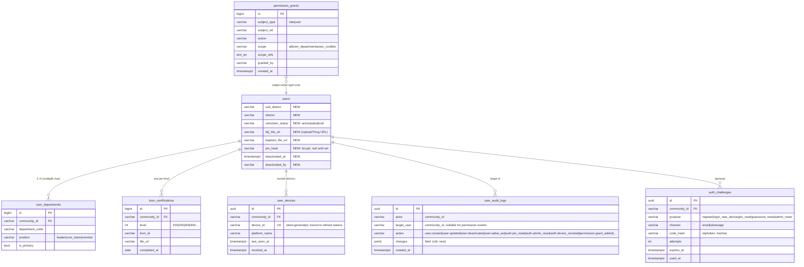
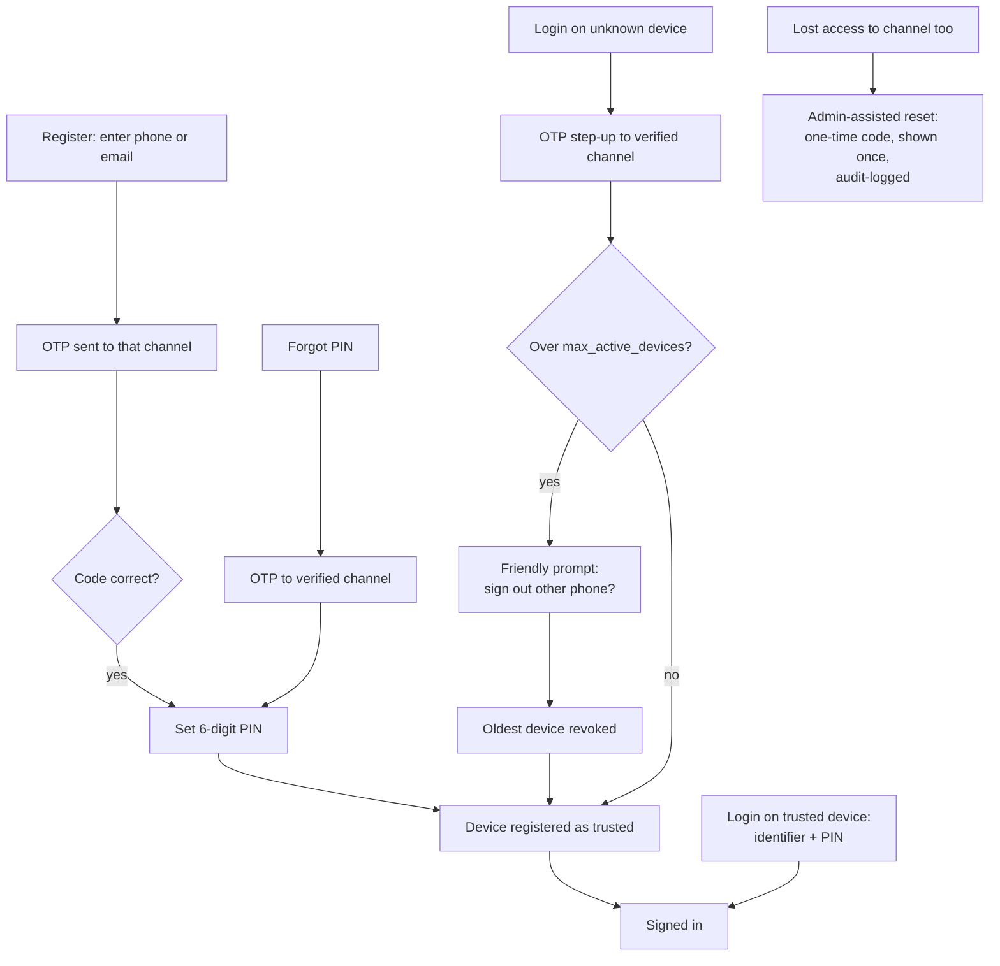

# MyGrow User Management — Design

**Date:** 2026-07-07
**Status:** Approved design, pre-implementation
**Source PRD:** MyGrow - User Management (App Team, P0, target 2026-04-30)
**Repo:** go-community — evolves the existing v2 user domain in place (no new-version module)

---

## 1. Goal & Principles

Move app-user management from "developer edits the database" to a permissioned, audited, self-service system for the GCO/admin team — plus a humanized, secure auth flow (OTP + PIN + device binding) designed for congregation members who may lack technological skill.

**Principles:**

1. **Evolve, don't rewrite.** The `users` table is the live identity table everything references by `community_id`. We ALTER and extend; login and existing v2 endpoints keep working throughout.
2. **Actions are code, grants are data.** The permission *catalog* is fixed in Go (safety); *who holds which action at which scope* is runtime-editable rows (flexibility) — Google-Sheets-style sharing to roles or individual people.
3. **Relational facts stay relational.** Departments and KOM certifications are one-to-many, queried across users (scoping, dashboard) — separate tables, presented embedded in the API resource so callers never feel them. (Deliberate contrast with events-v3, where document-shaped configs went JSONB.)
4. **Nothing to memorize except a 6-digit PIN.** The phone is the key: trusted-device + PIN daily; OTP only for new devices and resets; human (admin-assisted) fallback for every automated path.
5. **Shared infrastructure with events-v3:** the notification outbox/Notifier delivers OTPs and reset links (channel-abstracted: email now, WhatsApp slot ready); errors use `herr` with the same bilingual EN/ID humanized-message catalog and completeness gate.
6. **Everything operationally tunable via configdb** (the existing runtime config system): max departments per user, max active devices, OTP parameters, lockout thresholds, fallback policies, password-login flag.

**Out of scope (Phase 2):** the permissions-editing UI itself (API only), WhatsApp delivery (channel slot exists), bulk user import/export, logging of profile *views*, forced migration of existing password users to PIN.

---

## 2. Permission System — "sheets-style" grants

### 2.1 Action catalog (fixed, in code)

| Action | Meaning |
|---|---|
| `user.view_basic` | see name, date of birth, address, phone only (the PRD's view-role field set) |
| `user.view_full` | see every attribute incl. files, KKJ/KOM/baptism data |
| `user.manage` | create / edit / delete users (all attributes) |
| `user.activate` | activate / deactivate account; set volunteer sabat status |
| `user.audit.view` | read the audit trail |
| `user.dashboard.view` | demographic dashboard |
| `permission.manage` | edit the grants themselves; admin-assisted PIN/password resets |

Field visibility is bound to actions **in code** (`view_basic` = the four PRD fields; `view_full` = all) so no runtime edit can expose sensitive fields by typo.

### 2.2 Grants (runtime-editable rows)

```
permission_grants
├─ id
├─ subject_type   role | user                  ← share to a role OR a specific person
├─ subject_ref    e.g. "gco-view" | "1234567890" (community_id)
├─ action         e.g. "user.activate"
├─ scope          all | own_departments | own_cool | list
├─ scope_refs     TEXT[] — dept codes / cool ids when scope=list
├─ granted_by, created_at
```

- **Seeded from the PRD matrix** by migration:
  - GCO Admin, Super Admin → `user.manage`, `user.view_full`, `user.activate`, `user.dashboard.view` (scope all)
  - GCO View, Pastoral, Community Facilitator, Community Department → `user.view_basic` (Pastoral also `user.activate`, `user.dashboard.view`; scope all)
  - Department Leader → `user.view_basic` + `user.activate`, scope `own_departments`
  - Community Leader → `user.view_basic` + `user.activate`, scope `own_cool`
  - MIS → `user.view_basic`, `user.activate`, `user.audit.view`, `user.dashboard.view`
  - superadmin → `permission.manage` (plus hardcoded full access, below)
- **Scope resolution:** `own_departments` = departments where the actor's `user_departments.position = 'leader'`; `own_cool` = the COOL the actor leads/facilitates; `list` = explicit override refs. Derived default + explicit override, per decision.
- **Lock-out protection:** the evaluator hardcodes full access for the `superadmin` user type before consulting grants — no table edit can lock superadmin out.
- **Every grant change is audit-logged** (action `permission.grant_added` / `permission.grant_removed`).

### 2.3 Evaluator

```go
// pure given loaded grants; grants cached ~60s
Can(actor Actor, action string, target *TargetUser) (allowed bool, fields FieldSet, scopeFilter ScopeFilter)
```

- For list endpoints, `scopeFilter` translates to a SQL WHERE clause (dept membership / cool id) — scoping is applied **in the query**, never by post-filtering pages.
- Exhaustively unit-tested as a matrix (every seeded role × every action × in/out-of-scope target).
- Grant CRUD API: `GET/POST/DELETE /api/v2/permissions/grants` (requires `permission.manage`) — the future permissions UI's backend.

---

## 3. Data Model Changes



**Migrations & backfill:**
- `is_kom100 = true` → insert `kom_certifications(level=100)`; column kept read-only until frontend migrates, then dropped in a later cleanup migration.
- Existing `users.department` string → backfill `user_departments(is_primary=true, position='member')`; column deprecated the same way.
- Volunteer sabat: `volunteer_status` is independent of account `status` — a sabat volunteer logs in normally; a `deactivated` account cannot log in (enforced in the login usecases).
- Max departments per user: validated against configdb key `usermgmt.max_departments_per_user` (0 = unlimited; default 0 per "let it loose").
- **KOM status** of a user = `MAX(level)` across their certifications (progressive: 400 implies 100–300); all certificates retained. **Files** are UploadThing URLs only — the backend never stores bytes.
- API shape: departments and KOM certs are **embedded in the user resource** (`user.departments[]`, `user.kom.level`, `user.kom.certifications[]`) — the extra tables are invisible to callers.

---

## 4. Admin Features

### 4.1 Add / Edit / Delete user — `user.manage`
Full-attribute CRUD (all PRD attributes incl. relations, departments, KOM, files-as-URLs). Delete = soft delete. Every mutation computes a field-level diff (`old → new`) into `user_audit_logs` inside the same `Atomic` transaction.

### 4.2 View users — `user.view_full` / `user.view_basic`
Single list + detail endpoints; the evaluator's `FieldSet` filters the response shape (basic = name, date of birth, address, phone), and `ScopeFilter` restricts *which* users are visible (Dept Leader sees only their department's people; Community Leader only their COOL). Reuses the existing cursor pagination.

### 4.3 Activate / Deactivate / Sabat — `user.activate` (scoped)
One status endpoint: `PATCH /admin/users/{communityId}/status {account?: active|deactivated, volunteer?: active|sabat}`. Deactivation revokes all the user's devices/sessions immediately and blocks login with a humanized message. Audit-logged with reason field (optional free text).

### 4.4 Audit trail — `user.audit.view`
`GET /admin/audit-logs?target=&actor=&action=&from=&to=` — paginated, append-only source. Covers all user-management mutations, all auth-sensitive events (PIN/admin resets, device revocations), and all permission-grant changes. Views/logins are NOT logged (per decision).

### 4.5 Demographic dashboard — `user.dashboard.view`
`GET /admin/users/dashboard` → aggregate counts grouped by each PRD filter: volunteer status (active/sabat), department, community (COOL), KKJ status (has `kkj_number`), baptism status, KOM level, campus; plus total users and actives. Straight SQL `GROUP BY`s; frontend renders charts. Optional `?campus=`/`?department=` narrowing.

### 4.6 Event history on the profile
Read-only aggregation of the user's event registrations (v2 `event_registration_records` now; v3 `registrations` once shipped), newest first, with event title/date/attendance status. The PRD's categories (Preservice, Public Event, BPN, Counseling) surface via event topics/types as they exist — no new storage.

---

## 5. Humanized Auth — register, login, devices, PIN

Designed for low-tech users: **nothing to memorize except a 6-digit PIN; the phone is the key; every automated path has a human fallback.**

### 5.1 Flows



- **Register:** identifier (phone or email) → OTP proves ownership → set PIN → device trusted → in. No password, no username rules.
- **Daily login:** identifier + PIN on a trusted device. Two fields, done.
- **New device = step-up + device-cap enforcement:** OTP re-verification; if the user is at `max_active_devices` (configdb, **default 1**), a friendly bilingual prompt explains the other phone will be signed out; on confirm, the oldest device's sessions are revoked. Refresh tokens carry `device_id`; a revoked device's tokens die at next use.
- **Forgot PIN:** OTP → new PIN. **Forgot password** (legacy users): same challenge machinery, `purpose=password_reset`, email link per PRD.
- **Admin-assisted reset** (`permission.manage`): generates a one-time code shown exactly once in the admin UI response, `purpose=admin_reset`, audit-logged with actor — the fallback for members who lost access to everything.

### 5.2 Delivery & fallback (free-tier honest)

OTPs and reset links go through the **shared v3 notification outbox** with the `Notifier` channel abstraction — email now, `whatsapp` channel slot ready. Phone-only users until WhatsApp ships: daily PIN login on their trusted device works fine (no OTP needed); new-device verification falls back per configdb `usermgmt.otp_fallback` = `admin_assist` (default) | `allow_with_warning`.

### 5.3 Security floor

- OTP: 6 digits, 5-minute expiry, hashed at rest, max 5 attempts then cooldown; single-use (`used_at`).
- PIN: bcrypt with the existing salt scheme; progressive lockout on failed attempts (configdb thresholds) with humanized countdown message; never logged.
- Reset tokens: random 32-byte, hashed, 1-hour expiry, single-use. Forgot-password/PIN endpoints always return 200 regardless of account existence (no enumeration).
- Rate limiting via the existing limiter middleware on all auth endpoints.
- All auth-sensitive events audit-logged (5.1 flows) — but not routine logins (per audit-scope decision).
- Existing **password login stays enabled** behind configdb flag `usermgmt.password_login_enabled` (default true) — admins and legacy users are never locked out; PIN adoption is opt-in per user (having a `pin_hash` enables PIN login; passwordless users are OTP-onboarded).
- Deactivated accounts: all login paths blocked with the humanized bilingual message; devices revoked at deactivation time.

### 5.4 Configdb keys (all runtime-tunable)

```
usermgmt.max_departments_per_user   0 (unlimited)
usermgmt.max_active_devices         1
usermgmt.otp_length                 6
usermgmt.otp_expiry_minutes         5
usermgmt.otp_max_attempts           5
usermgmt.pin_lockout_attempts       5
usermgmt.pin_lockout_minutes        15
usermgmt.otp_fallback               admin_assist | allow_with_warning
usermgmt.password_login_enabled     true
```

---

## 6. API Surface

All under the existing `/api/v2` mount, existing JWT middleware; permission checks via the evaluator (not per-route role lists). Errors: **herr**, bilingual EN/ID, same catalog conventions and completeness gate as events-v3.

```
── Auth (public) ─────────────────────────────────────────────
POST /v2/auth/register/start         {identifier} → OTP sent (or fallback info)
POST /v2/auth/register/verify        {identifier, otp} → short-lived setup token
POST /v2/auth/register/complete      {setup_token, pin, profile basics, device}
POST /v2/auth/login                  {identifier, pin, device_id} → tokens | NEW_DEVICE_VERIFICATION_REQUIRED
POST /v2/auth/device/verify          {identifier, otp, device_id, replace_oldest?} → tokens
POST /v2/auth/pin/forgot             {identifier} → 200 always
POST /v2/auth/pin/reset              {identifier, otp, new_pin}
POST /v2/auth/forgot-password        {identifier} → 200 always (email link, PRD flow)
POST /v2/auth/reset-password         {token, new_password}

── Me (member) ───────────────────────────────────────────────
GET    /v2/me/devices                 list trusted devices
DELETE /v2/me/devices/{id}            sign out a device

── Admin (evaluator-gated) ───────────────────────────────────
GET    /v2/admin/users                        list; fields+rows per Can()
GET    /v2/admin/users/{communityId}          detail; fields per Can()
POST   /v2/admin/users                        create (user.manage)
PATCH  /v2/admin/users/{communityId}          edit incl. departments[], kom certs, files (user.manage)
DELETE /v2/admin/users/{communityId}          soft delete (user.manage)
PATCH  /v2/admin/users/{communityId}/status   account/volunteer status (user.activate, scoped)
POST   /v2/admin/users/{communityId}/reset    admin-assisted one-time code (permission.manage)
GET    /v2/admin/users/{communityId}/events   event history (view scope applies)
GET    /v2/admin/users/dashboard              aggregates (user.dashboard.view)
GET    /v2/admin/audit-logs                   (user.audit.view)
GET/POST/DELETE /v2/permissions/grants        (permission.manage)
```

---

## 7. Code Structure & Conventions

```
internal/models/usermgmt/        entities (grants, devices, challenges, audit), configs, DTOs
internal/pkg/permission/         action catalog, FieldSets, Can() evaluator + cache (pure core)
internal/pkg/otp/                challenge create/verify (pure given clock+store)
internal/repositories/pgsql/     new repos: grants, devices, challenges, audit, departments, kom
internal/usecases/usermgmt/      adminUserUsecase, authUsecase, auditUsecase, dashboardUsecase, grantUsecase
internal/deliveries/http/v2/     new handlers mounted beside existing v2 handlers
```

Conventions carried over from events-v3 (now house rules): `Atomic`-only transactions, herr bilingual errors, pure validator packages unit-tested without DB, configdb for tunables, shared notification outbox for all outbound messages.

Existing v2 user endpoints (`/v2/users/*`) remain untouched and functional; the new admin surface supersedes them for management. The old `middleware.UserMiddleware(roles...)` stays for non-user-management routes.

---

## 8. Concurrency, Integrity & Failure Handling

| Concern | Mechanism |
|---|---|
| Grant edit locks everyone out | superadmin bypass hardcoded in evaluator |
| OTP brute force | hashed codes, attempt counter on the challenge row, cooldown, rate limiter |
| Two devices race the last device slot | device registration inside `Atomic` with the user row locked |
| Token replay after device revoked | refresh tokens carry device_id; validation joins `user_devices.revoked_at IS NULL` |
| Audit write lost | diff + audit row written in the same transaction as the mutation |
| Account enumeration | forgot endpoints always 200; identical timing paths |
| Stale grant cache grants too much | 60s TTL; revocation-sensitive actions (`permission.manage`, `user.manage`) bypass cache |

## 9. Testing Strategy

- **Unit (pure):** permission matrix (every seeded role × action × in/out-of-scope), FieldSet filtering, OTP lifecycle (expiry/attempts/single-use), device-cap logic, diff computation for audit.
- **Integration:** register→login→new-device→revoke flow end-to-end; scoped list queries (dept leader sees only own dept); status change revokes sessions; audit rows written transactionally; grant CRUD + cache bypass; dashboard aggregates against seeded fixtures; forgot-password/PIN token single-use.
- **Bilingual gate:** every new herr class has EN + ID messages (same completeness test pattern as events-v3).

## 10. Rollout

1. Ship migrations + permission system dark; seed grants; verify evaluator against PRD matrix in staging.
2. Enable admin CRUD/view/status for GCO on real data (password login untouched).
3. Enable OTP+PIN registration for new users; invite existing users to set a PIN (optional).
4. Flip `max_active_devices` enforcement on after a grace week.
5. Audit + dashboard + forgot-password land with the admin UI.
